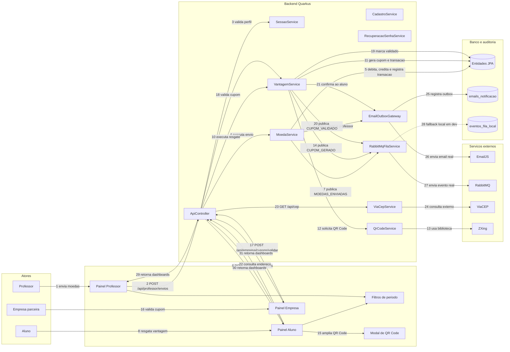

# DiagramaDeComunicacao - release 2-3

Artefato das Releases 2 e 3 do Valoriza Ae.

Este diagrama mostra como os participantes se comunicam quando uma operacao gera saldo, cupom, email, evento de fila e atualizacao de painel.

## Diagrama de comunicacao

## Mensagens principais

- MOEDAS_ENVIADAS: envio confirmado pelo professor.
- CUPOM_GERADO: vantagem resgatada e cupom pendente.
- CUPOM_VALIDADO: atendimento confirmado pela empresa.
- CUPOM_DESATIVADO e CUPOM_REATIVADO: status da vantagem mudou e aluno foi avisado.
