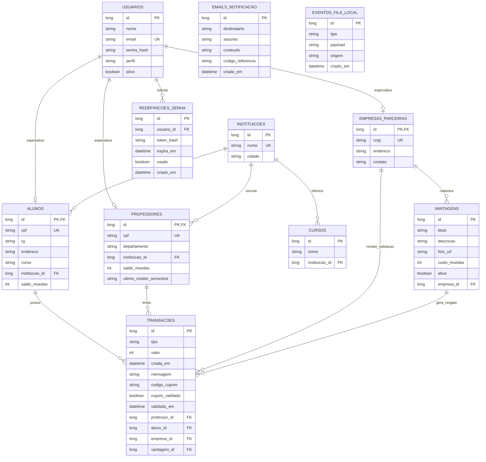

# DiagramaDeDados - release 2-3

Artefato das Releases 2 e 3 do Valoriza Ae.

Este diagrama mostra as entidades persistidas e as relacoes afetadas pelas funcionalidades das Releases 2 e 3.

## Diagrama de dados

## Regras representadas

- usuarios concentra login, senha, perfil e status ativo.
- alunos, professores e empresas_parceiras especializam usuarios por heranca JPA joined.
- instituicoes e cursos sao pre-cadastrados; o aluno escolhe uma instituicao e um curso valido para ela.
- professores ficam vinculados a uma instituicao e possuem cota semestral em saldo_moedas.
- vantagens pertencem a uma empresa e possuem status ativo/inativo.
- transacoes registra credito semestral, envio de moedas e resgate de vantagem com cupom.
- codigo_cupom, cupom_validado e validado_em controlam o ciclo do cupom.
- emails_notificacao registra notificacoes internas e emails enviados pelo EmailJS.
- redefinicoes_senha guarda tokens de recuperacao por hash e validade.
- eventos_fila_local preserva rastreabilidade quando o fallback local da fila esta ativo em desenvolvimento.
