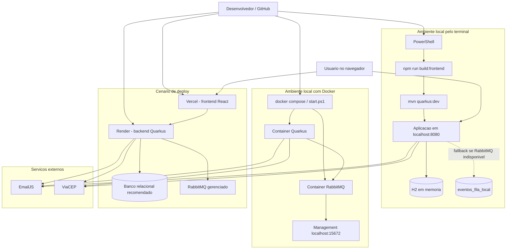

# DiagramaDeImplantacao - release 2-3

Artefato das Releases 2 e 3 do Valoriza Ae.

Este diagrama mostra como o sistema roda localmente, em Docker e em um cenario de deploy separado entre frontend e backend.

## Diagrama de implantacao

## Nos e responsabilidades

- localhost:8080: entrega frontend compilado e API Quarkus no laboratorio.
- H2: banco em memoria usado para execucao local e testes academicos.
- RabbitMQ: fila real dos eventos de negocio quando executado com Docker ou deploy.
- eventos_fila_local: fallback de rastreabilidade usado em desenvolvimento quando habilitado.
- EmailJS: envio real de emails de moedas, cupons, validacoes e recuperacao de senha.
- ViaCEP: consulta de endereco por CEP nos cadastros.
- Vercel e Render: separacao recomendada entre frontend e backend em deploy.
