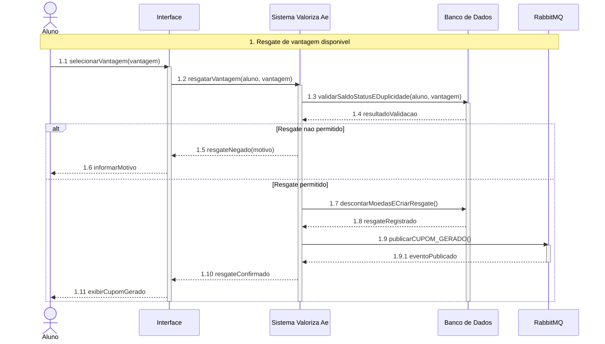

# DiagramaDeSequencia - RF-07 - Aluno resgata vantagens disponiveis

Artefato das Releases 2 e 3 do Valoriza Ae.

Diagrama de sequencia derivado do requisito funcional correspondente.

[Voltar ao indice geral](DiagramaDeSequencia-release-2-3.md)

