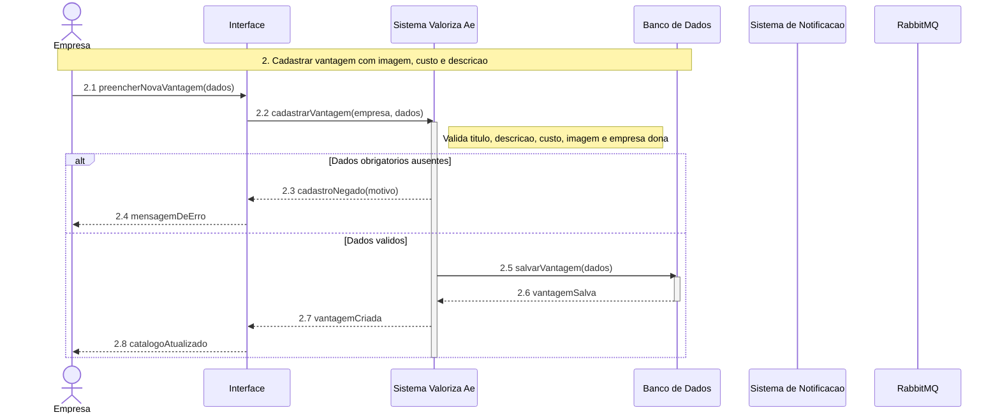

# DiagramaDeSequencia - UC-28 - Cadastrar vantagem com imagem, custo e descricao

Artefato das Releases 2 e 3 do Valoriza Ae.

Modelo baseado no gabarito: participantes fixos, bloco numerado, mensagens numeradas, retornos tracejados e fragmentos UML quando necessario.

[Voltar ao indice geral](DiagramaDeSequencia-release-2-3.md) | [Voltar ao grupo](DiagramaDeSequencia-04-empresa-parceira.md)

