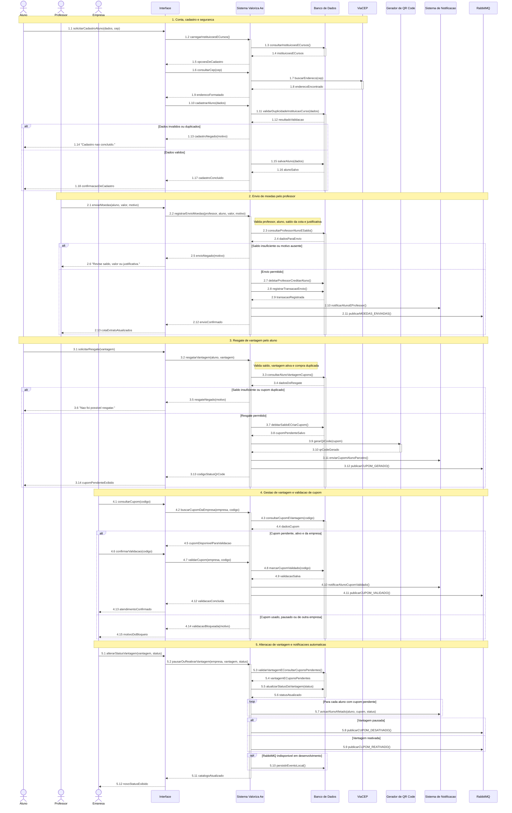

# DiagramaDeSequencia completo - release 2-3

Artefato das Releases 2 e 3 do Valoriza Ae.

Este arquivo mantem uma visao consolidada no modelo do gabarito: participantes fixos, blocos numerados, mensagens numeradas, retornos tracejados, notas de regra e fragmentos `alt`, `loop` e `opt`.

A versao dividida por caso de uso fica em `DiagramaDeSequencia-release-2-3.md`.

## Diagrama de sequencia completo

## Observacao

O diagrama completo foi mantido como visao geral. Para avaliacao detalhada por caso de uso, use os arquivos de partes indicados no indice `DiagramaDeSequencia-release-2-3.md`.
