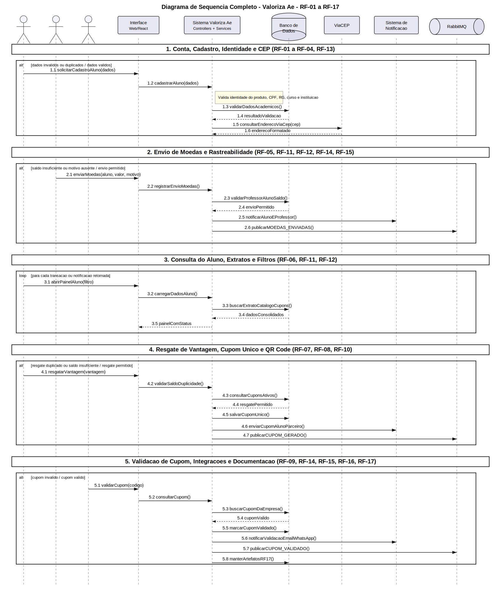

# DiagramaDeSequencia completo - release 2-3

Artefato das Releases 2 e 3 do Valoriza Ae.

Este arquivo mantem a versao consolidada do diagrama de sequencia derivado dos requisitos funcionais RF-01 a RF-17.

A imagem abaixo usa SVG para permitir os formatos solicitados: Banco de Dados em cilindro e RabbitMQ em cilindro horizontal.

## Observacao

Os diagramas separados por requisito funcional ficam no indice `DiagramaDeSequencia-release-2-3.md`.
