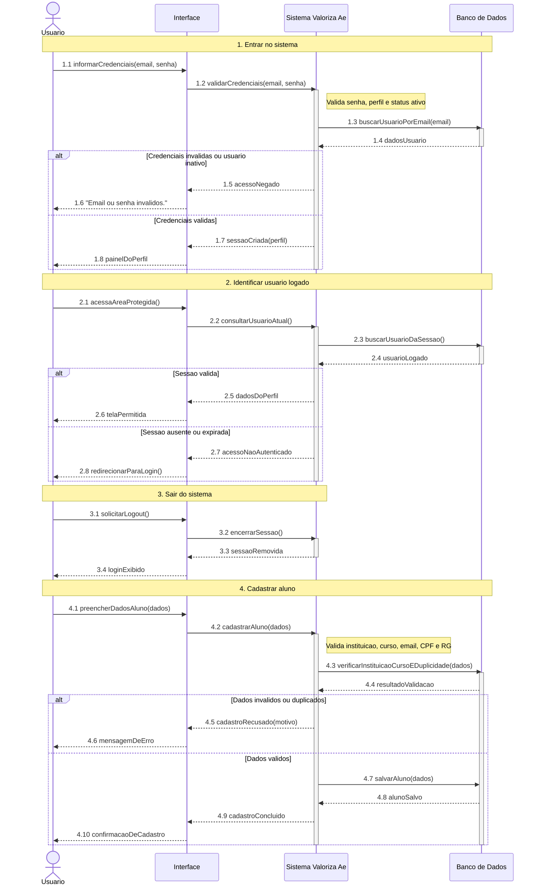

# DiagramaDeSequencia - Conta, cadastro e seguranca - UC-01 a UC-04

Artefato das Releases 2 e 3 do Valoriza Ae.

Modelo baseado no gabarito: participantes fixos, blocos numerados, mensagens numeradas, retornos tracejados, notas de regra e fragmentos `alt`.

[Voltar ao indice geral](DiagramaDeSequencia-release-2-3.md) | [Voltar ao grupo](DiagramaDeSequencia-01-conta-cadastro-seguranca.md)

