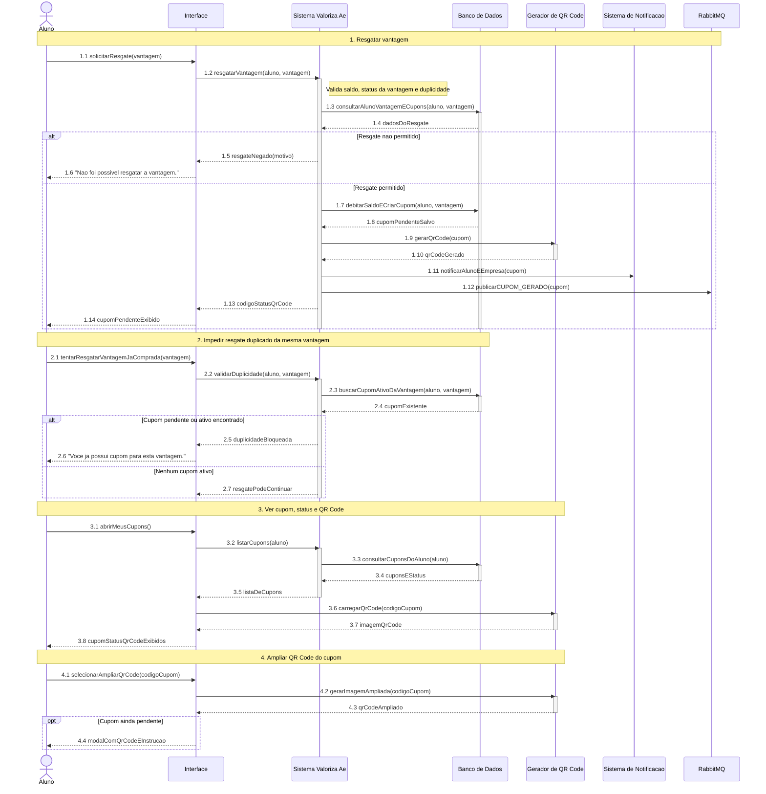

# DiagramaDeSequencia - Aluno - UC-16 a UC-19

Artefato das Releases 2 e 3 do Valoriza Ae.

Modelo baseado no gabarito: participantes fixos, blocos numerados, mensagens numeradas, retornos tracejados, notas de regra e fragmentos `alt`/`opt`.

[Voltar ao indice geral](DiagramaDeSequencia-release-2-3.md) | [Voltar ao grupo](DiagramaDeSequencia-02-aluno.md)

