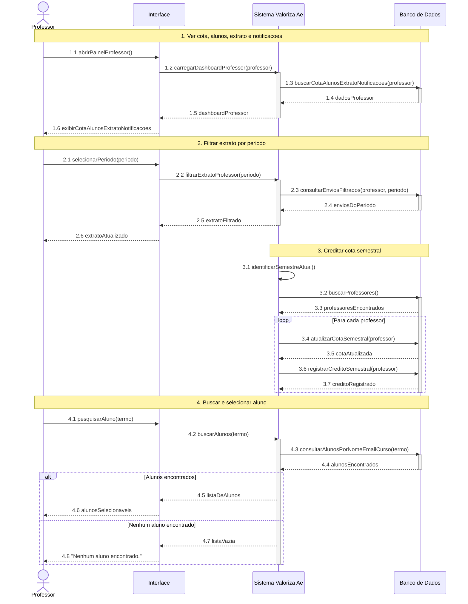

# DiagramaDeSequencia - Professor - UC-20 a UC-23

Artefato das Releases 2 e 3 do Valoriza Ae.

Modelo baseado no gabarito: participantes fixos, blocos numerados, mensagens numeradas, retornos tracejados e fragmentos `alt`.

[Voltar ao indice geral](DiagramaDeSequencia-release-2-3.md) | [Voltar ao grupo](DiagramaDeSequencia-03-professor.md)

