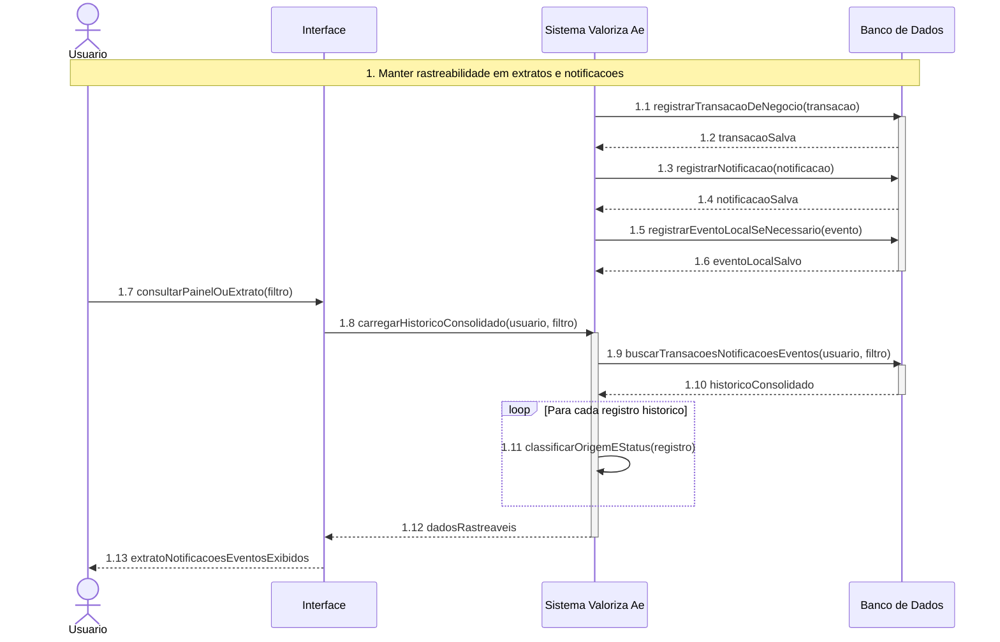

# DiagramaDeSequencia - Integracoes e rastreabilidade - UC-41

Artefato das Releases 2 e 3 do Valoriza Ae.

Modelo baseado no gabarito: participantes fixos, bloco numerado, mensagens numeradas, retornos tracejados e fragmento `loop`.

[Voltar ao indice geral](DiagramaDeSequencia-release-2-3.md) | [Voltar ao grupo](DiagramaDeSequencia-05-integracoes-rastreabilidade.md)

