# DiagramaDeSequencia - release 2-3

Artefato das Releases 2 e 3 do Valoriza Ae.

Este arquivo separa os diagramas de sequencia por caso de uso. Cada diagrama representa um fluxo isolado do diagrama de casos de uso, evitando concentrar todas as mensagens em um unico diagrama grande.

Os participantes usam nomes de atores, telas, controllers, services, repositories e integracoes do projeto sempre que possivel.

## Conta, cadastro e seguranca

### UC-01 - Entrar no sistema

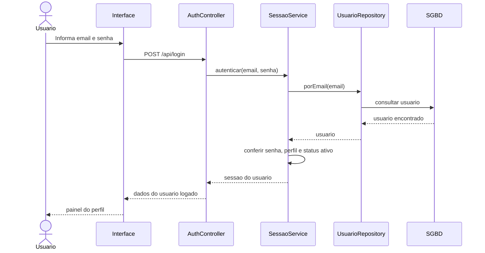

### UC-02 - Identificar usuario logado

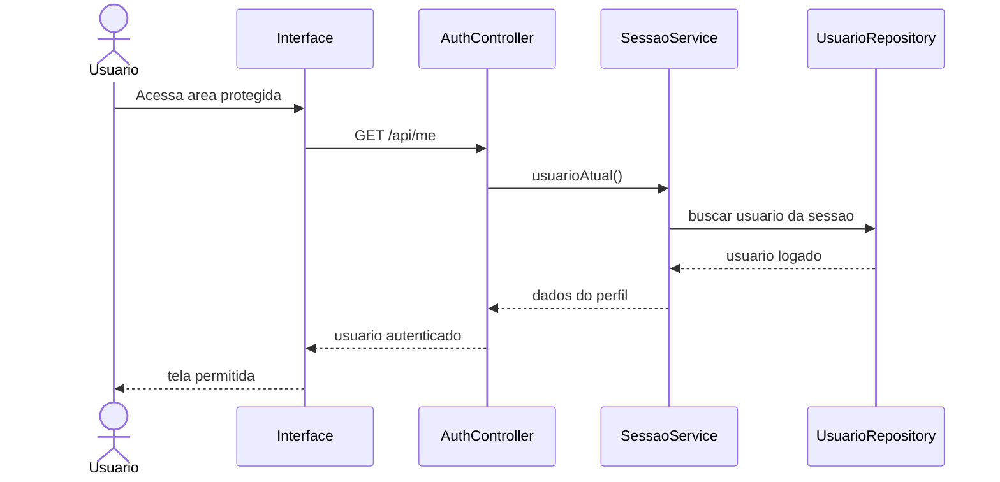

### UC-03 - Sair do sistema

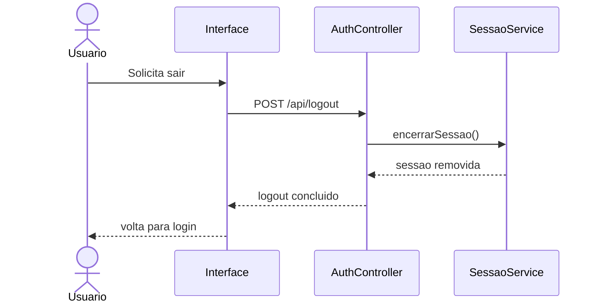

### UC-04 - Cadastrar aluno

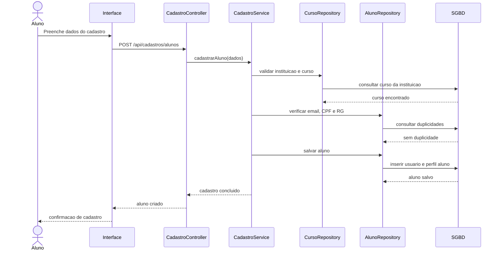

### UC-05 - Cadastrar empresa parceira

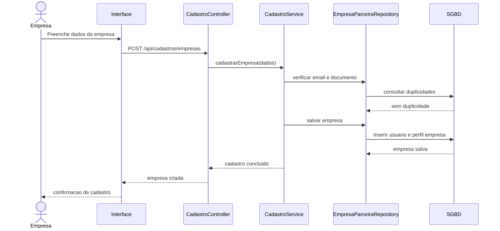

### UC-06 - Selecionar instituicao pre-cadastrada

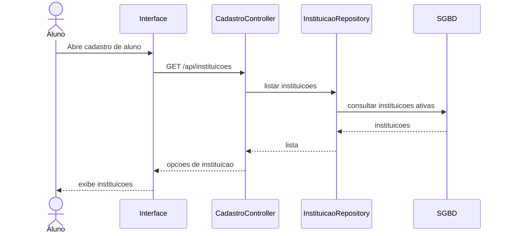

### UC-07 - Selecionar curso da instituicao

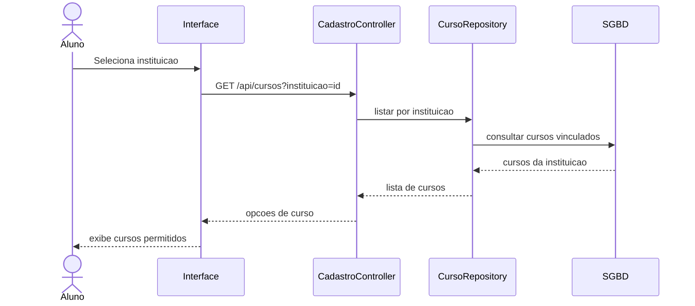

### UC-08 - Consultar endereco por CEP

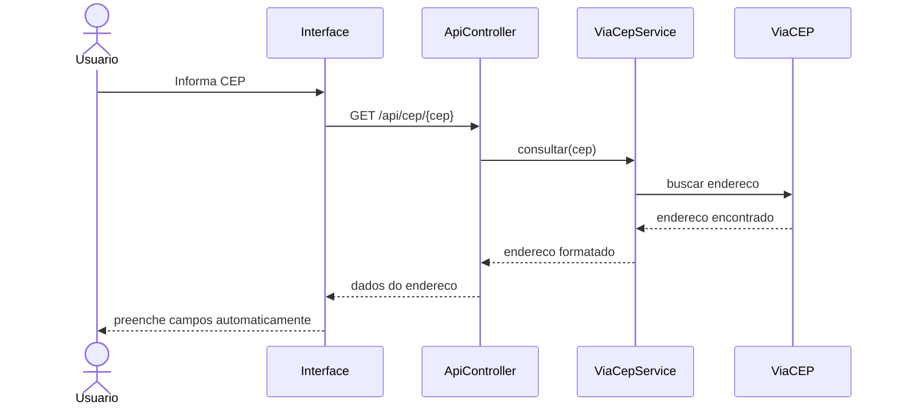

### UC-09 - Solicitar recuperacao de senha

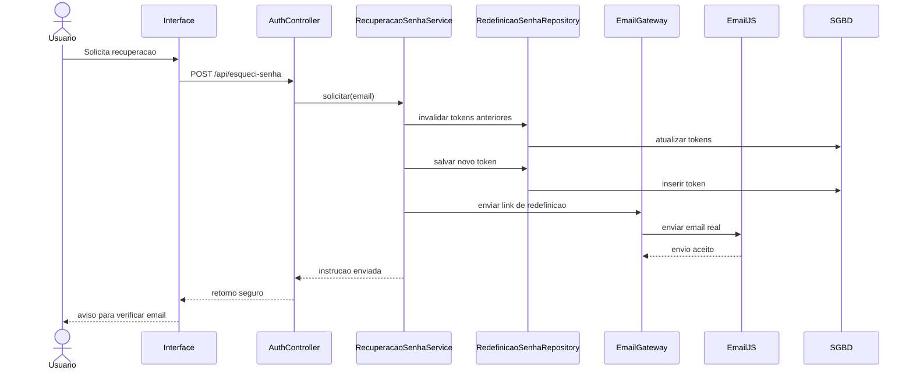

### UC-10 - Redefinir senha por link

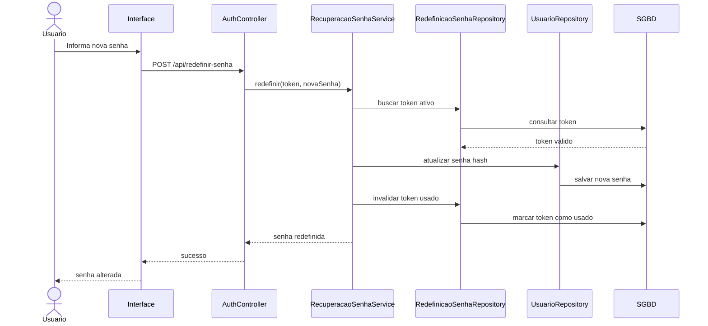

### UC-11 - Bloquear acesso fora do perfil

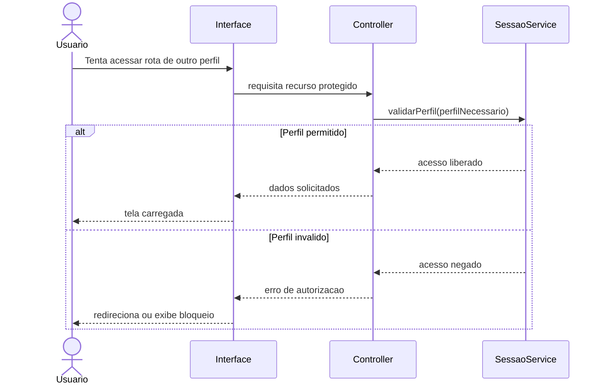

## Aluno

### UC-12 - Ver saldo, extrato, notificacoes e cupons

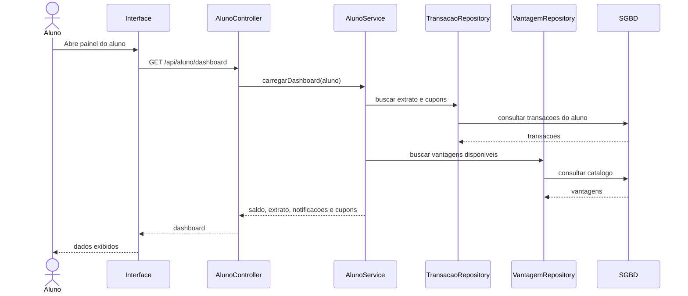

### UC-13 - Filtrar extrato por periodo

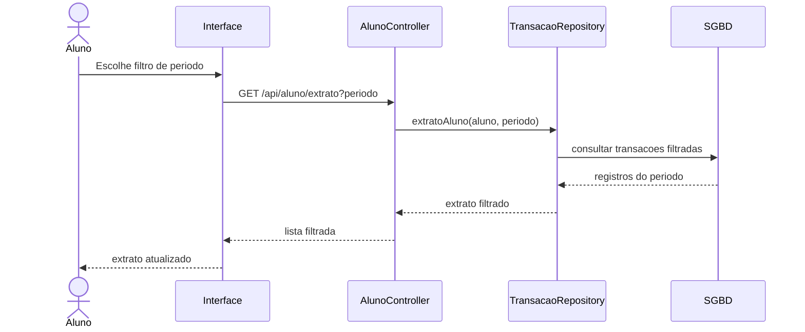

### UC-14 - Consultar catalogo de vantagens

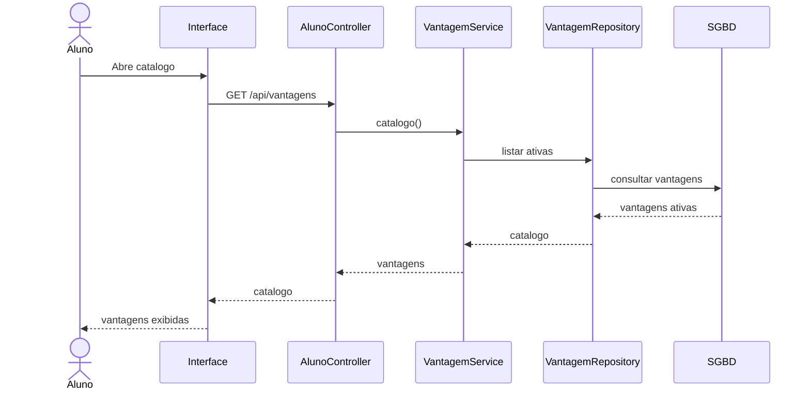

### UC-15 - Filtrar vantagens disponiveis, adquiridas e metas

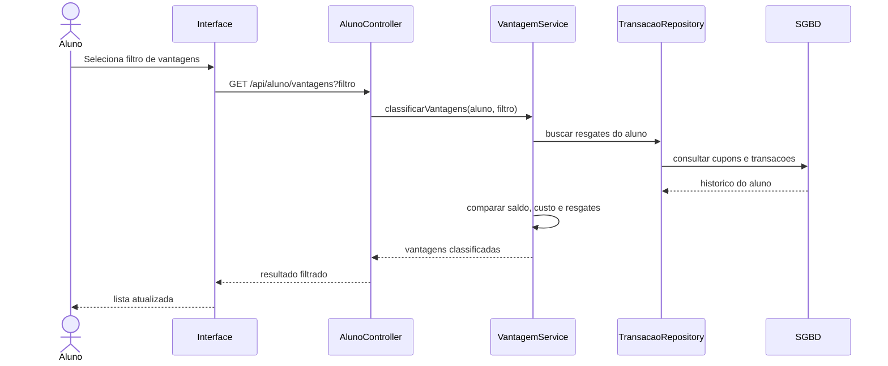

### UC-16 - Resgatar vantagem

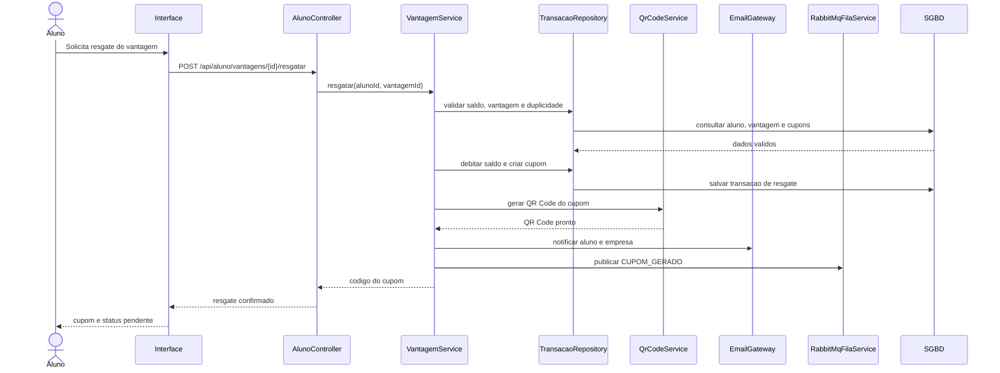

### UC-17 - Impedir resgate duplicado da mesma vantagem

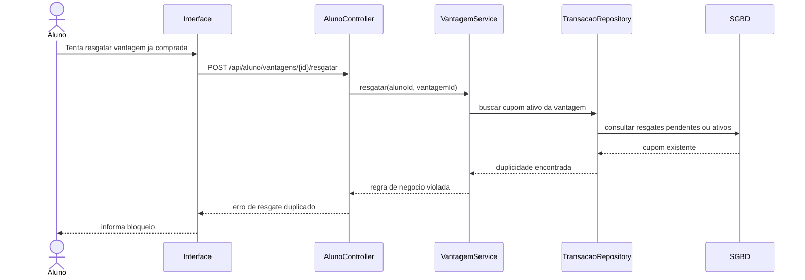

### UC-18 - Ver cupom, status e QR Code

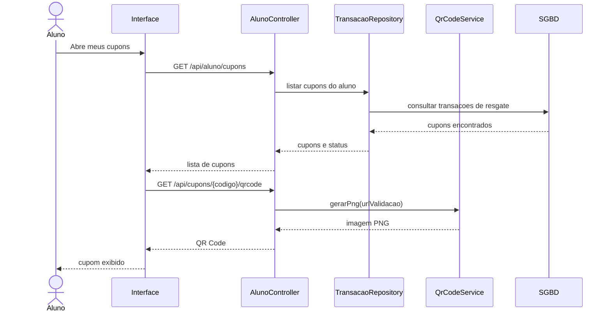

### UC-19 - Ampliar QR Code do cupom

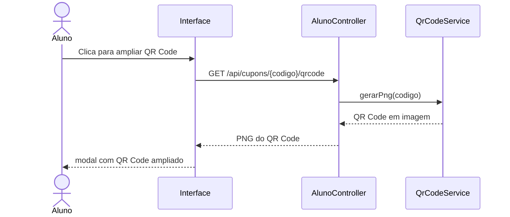

## Professor

### UC-20 - Ver cota, alunos, extrato e notificacoes

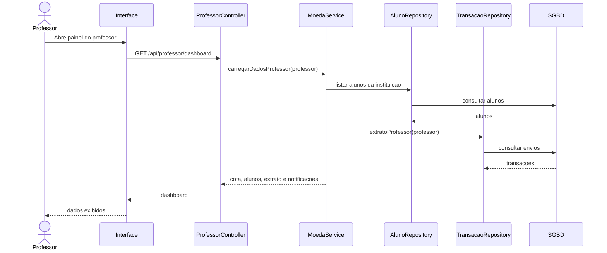

### UC-21 - Filtrar extrato por periodo

```mermaid
sequenceDiagram
    actor Professor
    participant Interface
    participant ProfessorController
    participant TransacaoRepository
    participant SGBD

    Professor->>Interface: Escolhe periodo do extrato
    Interface->>ProfessorController: GET /api/professor/extrato?periodo
    ProfessorController->>TransacaoRepository: extratoProfessor(professor, periodo)
    TransacaoRepository->>SGBD: consultar envios filtrados
    SGBD-->>TransacaoRepository: registros
    TransacaoRepository-->>ProfessorController: extrato filtrado
    ProfessorController-->>Interface: dados filtrados
    Interface-->>Professor: extrato atualizado
```

### UC-22 - Creditar cota semestral

```mermaid
sequenceDiagram
    participant Sistema
    participant DadosIniciais
    participant SemestreUtil
    participant ProfessorRepository
    participant TransacaoRepository
    participant SGBD

    Sistema->>DadosIniciais: iniciar dados da aplicacao
    DadosIniciais->>SemestreUtil: identificar semestre atual
    SemestreUtil-->>DadosIniciais: semestre
    DadosIniciais->>ProfessorRepository: buscar professores
    ProfessorRepository->>SGBD: consultar professores
    SGBD-->>ProfessorRepository: professores
    DadosIniciais->>ProfessorRepository: atualizar cota semestral
    DadosIniciais->>TransacaoRepository: registrar credito semestral
    TransacaoRepository->>SGBD: salvar credito
    SGBD-->>DadosIniciais: cota registrada
```

### UC-23 - Buscar e selecionar aluno

```mermaid
sequenceDiagram
    actor Professor
    participant Interface
    participant ProfessorController
    participant AlunoRepository
    participant SGBD

    Professor->>Interface: Pesquisa aluno
    Interface->>ProfessorController: GET /api/professor/alunos?busca
    ProfessorController->>AlunoRepository: buscar por nome, email ou curso
    AlunoRepository->>SGBD: consultar alunos
    SGBD-->>AlunoRepository: alunos encontrados
    AlunoRepository-->>ProfessorController: lista
    ProfessorController-->>Interface: alunos filtrados
    Interface-->>Professor: aluno selecionavel
```

### UC-24 - Enviar moedas com justificativa

```mermaid
sequenceDiagram
    actor Professor
    participant Interface
    participant ProfessorController
    participant MoedaService
    participant TransacaoRepository
    participant EmailGateway
    participant RabbitMqFilaService
    participant SGBD

    Professor->>Interface: Informa aluno, valor e justificativa
    Interface->>ProfessorController: POST /api/professor/moedas
    ProfessorController->>MoedaService: enviarMoedas(professorId, alunoId, valor, motivo)
    MoedaService->>TransacaoRepository: validar saldo, aluno e motivo
    TransacaoRepository->>SGBD: consultar professor e aluno
    SGBD-->>TransacaoRepository: dados validos
    MoedaService->>TransacaoRepository: debitar professor, creditar aluno e registrar envio
    TransacaoRepository->>SGBD: salvar transacao
    MoedaService->>EmailGateway: notificar aluno e professor
    MoedaService->>RabbitMqFilaService: publicar MOEDAS_ENVIADAS
    MoedaService-->>ProfessorController: envio confirmado
    ProfessorController-->>Interface: sucesso
    Interface-->>Professor: cota e extrato atualizados
```

### UC-25 - Validar saldo e motivo do envio

```mermaid
sequenceDiagram
    actor Professor
    participant Interface
    participant ProfessorController
    participant MoedaService
    participant ProfessorRepository
    participant AlunoRepository
    participant SGBD

    Professor->>Interface: Confirma envio de moedas
    Interface->>ProfessorController: POST /api/professor/moedas
    ProfessorController->>MoedaService: validarEnvio(professorId, alunoId, valor, motivo)
    MoedaService->>ProfessorRepository: buscar professor
    ProfessorRepository->>SGBD: consultar professor
    SGBD-->>ProfessorRepository: saldo da cota
    MoedaService->>AlunoRepository: buscar aluno
    AlunoRepository->>SGBD: consultar aluno
    SGBD-->>AlunoRepository: aluno encontrado
    alt Saldo suficiente e motivo informado
        MoedaService-->>ProfessorController: envio permitido
    else Regra invalida
        MoedaService-->>ProfessorController: erro de validacao
        ProfessorController-->>Interface: mensagem de erro
        Interface-->>Professor: corrige valor ou motivo
    end
```

### UC-26 - Receber confirmacao do envio

```mermaid
sequenceDiagram
    actor Professor
    participant MoedaService
    participant EmailGateway
    participant EmailJS
    participant WhatsappGateway

    MoedaService->>EmailGateway: enviar confirmacao ao professor
    EmailGateway->>EmailJS: enviar email real
    EmailJS-->>EmailGateway: email aceito
    EmailGateway->>WhatsappGateway: enviar aviso no WhatsApp
    WhatsappGateway-->>Professor: mensagem enviada
    EmailGateway-->>MoedaService: notificacao registrada
```

## Empresa parceira

### UC-27 - Ver catalogo, cupons e historico

```mermaid
sequenceDiagram
    actor Empresa
    participant Interface
    participant EmpresaController
    participant VantagemService
    participant VantagemRepository
    participant TransacaoRepository
    participant SGBD

    Empresa->>Interface: Abre painel da empresa
    Interface->>EmpresaController: GET /api/empresa/dashboard
    EmpresaController->>VantagemService: carregarDashboard(empresa)
    VantagemService->>VantagemRepository: listar vantagens da empresa
    VantagemRepository->>SGBD: consultar vantagens
    SGBD-->>VantagemRepository: catalogo
    VantagemService->>TransacaoRepository: buscar cupons e historico
    TransacaoRepository->>SGBD: consultar resgates
    SGBD-->>TransacaoRepository: cupons e historico
    VantagemService-->>EmpresaController: dashboard
    EmpresaController-->>Interface: catalogo, cupons e historico
    Interface-->>Empresa: dados exibidos
```

### UC-28 - Cadastrar vantagem com imagem, custo e descricao

```mermaid
sequenceDiagram
    actor Empresa
    participant Interface
    participant EmpresaController
    participant VantagemService
    participant VantagemRepository
    participant SGBD

    Empresa->>Interface: Preenche nova vantagem
    Interface->>EmpresaController: POST /api/empresa/vantagens
    EmpresaController->>VantagemService: cadastrarVantagem(dados)
    VantagemService->>VantagemService: validar titulo, custo, descricao e imagem
    VantagemService->>VantagemRepository: salvar vantagem
    VantagemRepository->>SGBD: inserir vantagem
    SGBD-->>VantagemRepository: vantagem salva
    VantagemRepository-->>VantagemService: vantagem criada
    VantagemService-->>EmpresaController: cadastro concluido
    EmpresaController-->>Interface: vantagem criada
    Interface-->>Empresa: catalogo atualizado
```

### UC-29 - Editar vantagem

```mermaid
sequenceDiagram
    actor Empresa
    participant Interface
    participant EmpresaController
    participant VantagemService
    participant VantagemRepository
    participant SGBD

    Empresa->>Interface: Altera dados da vantagem
    Interface->>EmpresaController: PUT /api/empresa/vantagens/{id}
    EmpresaController->>VantagemService: editarVantagem(empresaId, vantagemId, dados)
    VantagemService->>VantagemRepository: buscar vantagem da empresa
    VantagemRepository->>SGBD: consultar vantagem
    SGBD-->>VantagemRepository: vantagem encontrada
    VantagemService->>VantagemRepository: atualizar dados
    VantagemRepository->>SGBD: salvar alteracoes
    SGBD-->>VantagemRepository: vantagem atualizada
    VantagemService-->>EmpresaController: edicao concluida
    EmpresaController-->>Interface: sucesso
    Interface-->>Empresa: vantagem atualizada
```

### UC-30 - Pausar vantagem

```mermaid
sequenceDiagram
    actor Empresa
    participant Interface
    participant EmpresaController
    participant VantagemService
    participant VantagemRepository
    participant TransacaoRepository
    participant EmailGateway
    participant RabbitMqFilaService
    participant SGBD

    Empresa->>Interface: Solicita pausar vantagem
    Interface->>EmpresaController: PATCH /api/empresa/vantagens/{id}/pausar
    EmpresaController->>VantagemService: pausarVantagem(empresaId, vantagemId)
    VantagemService->>VantagemRepository: validar vantagem da empresa
    VantagemRepository->>SGBD: consultar vantagem
    SGBD-->>VantagemRepository: vantagem encontrada
    VantagemService->>VantagemRepository: marcar como pausada
    VantagemService->>TransacaoRepository: consultar cupons pendentes
    TransacaoRepository->>SGBD: buscar cupons afetados
    SGBD-->>TransacaoRepository: cupons pendentes
    VantagemService->>EmailGateway: avisar alunos afetados
    VantagemService->>RabbitMqFilaService: publicar CUPOM_DESATIVADO
    VantagemService-->>EmpresaController: pausa concluida
    EmpresaController-->>Interface: novo status
    Interface-->>Empresa: vantagem pausada
```

### UC-31 - Reativar vantagem

```mermaid
sequenceDiagram
    actor Empresa
    participant Interface
    participant EmpresaController
    participant VantagemService
    participant VantagemRepository
    participant TransacaoRepository
    participant EmailGateway
    participant RabbitMqFilaService
    participant SGBD

    Empresa->>Interface: Solicita reativar vantagem
    Interface->>EmpresaController: PATCH /api/empresa/vantagens/{id}/reativar
    EmpresaController->>VantagemService: reativarVantagem(empresaId, vantagemId)
    VantagemService->>VantagemRepository: validar vantagem da empresa
    VantagemRepository->>SGBD: consultar vantagem
    SGBD-->>VantagemRepository: vantagem encontrada
    VantagemService->>VantagemRepository: marcar como ativa
    VantagemService->>TransacaoRepository: consultar cupons pendentes
    TransacaoRepository->>SGBD: buscar cupons afetados
    SGBD-->>TransacaoRepository: cupons pendentes
    VantagemService->>EmailGateway: avisar alunos afetados
    VantagemService->>RabbitMqFilaService: publicar CUPOM_REATIVADO
    VantagemService-->>EmpresaController: reativacao concluida
    EmpresaController-->>Interface: novo status
    Interface-->>Empresa: vantagem reativada
```

### UC-32 - Excluir vantagem sem historico de cupom

```mermaid
sequenceDiagram
    actor Empresa
    participant Interface
    participant EmpresaController
    participant VantagemService
    participant VantagemRepository
    participant TransacaoRepository
    participant SGBD

    Empresa->>Interface: Solicita excluir vantagem
    Interface->>EmpresaController: DELETE /api/empresa/vantagens/{id}
    EmpresaController->>VantagemService: excluirVantagem(empresaId, vantagemId)
    VantagemService->>VantagemRepository: buscar vantagem da empresa
    VantagemRepository->>SGBD: consultar vantagem
    SGBD-->>VantagemRepository: vantagem encontrada
    VantagemService->>TransacaoRepository: verificar historico de resgates
    TransacaoRepository->>SGBD: consultar cupons da vantagem
    alt Sem historico
        SGBD-->>TransacaoRepository: nenhum cupom
        VantagemService->>VantagemRepository: remover vantagem
        VantagemRepository->>SGBD: excluir registro
        VantagemService-->>EmpresaController: exclusao concluida
        EmpresaController-->>Interface: sucesso
        Interface-->>Empresa: vantagem removida
    else Possui historico
        SGBD-->>TransacaoRepository: cupons encontrados
        VantagemService-->>EmpresaController: exclusao bloqueada
        EmpresaController-->>Interface: orientar pausa
        Interface-->>Empresa: bloqueio exibido
    end
```

### UC-33 - Notificar aluno com cupom pendente

```mermaid
sequenceDiagram
    participant VantagemService
    participant TransacaoRepository
    participant EmailGateway
    participant WhatsappGateway
    participant Aluno
    participant SGBD

    VantagemService->>TransacaoRepository: consultar cupons pendentes da vantagem
    TransacaoRepository->>SGBD: buscar transacoes pendentes
    SGBD-->>TransacaoRepository: alunos afetados
    TransacaoRepository-->>VantagemService: cupons pendentes
    loop Para cada aluno afetado
        VantagemService->>EmailGateway: registrar e enviar aviso
        EmailGateway->>WhatsappGateway: enviar mensagem opcional
        WhatsappGateway-->>Aluno: aviso de status do cupom
    end
```

### UC-34 - Consultar cupom por codigo

```mermaid
sequenceDiagram
    actor Empresa
    participant Interface
    participant EmpresaController
    participant VantagemService
    participant TransacaoRepository
    participant SGBD

    Empresa->>Interface: Informa codigo do cupom
    Interface->>EmpresaController: GET /api/empresa/cupons/{codigo}
    EmpresaController->>VantagemService: consultarCupom(empresaId, codigo)
    VantagemService->>TransacaoRepository: buscar cupom da empresa
    TransacaoRepository->>SGBD: consultar transacao por codigo
    SGBD-->>TransacaoRepository: cupom encontrado
    TransacaoRepository-->>VantagemService: dados do cupom
    VantagemService-->>EmpresaController: status e vantagem
    EmpresaController-->>Interface: detalhes do cupom
    Interface-->>Empresa: dados para conferencia
```

### UC-35 - Validar cupom do aluno

```mermaid
sequenceDiagram
    actor Empresa
    participant Interface
    participant EmpresaController
    participant VantagemService
    participant TransacaoRepository
    participant EmailGateway
    participant RabbitMqFilaService
    participant SGBD

    Empresa->>Interface: Confirma validacao do cupom
    Interface->>EmpresaController: POST /api/empresa/cupons/{codigo}/validar
    EmpresaController->>VantagemService: validarCupom(empresaId, codigo)
    VantagemService->>TransacaoRepository: consultar cupom da empresa
    TransacaoRepository->>SGBD: buscar transacao pendente
    SGBD-->>TransacaoRepository: cupom valido
    VantagemService->>TransacaoRepository: marcar cupom validado
    TransacaoRepository->>SGBD: salvar validacao
    VantagemService->>EmailGateway: notificar aluno
    VantagemService->>RabbitMqFilaService: publicar CUPOM_VALIDADO
    VantagemService-->>EmpresaController: validacao concluida
    EmpresaController-->>Interface: sucesso
    Interface-->>Empresa: atendimento confirmado
```

### UC-36 - Bloquear cupom usado, pausado ou de outra empresa

```mermaid
sequenceDiagram
    actor Empresa
    participant Interface
    participant EmpresaController
    participant VantagemService
    participant TransacaoRepository
    participant SGBD

    Empresa->>Interface: Tenta validar cupom
    Interface->>EmpresaController: POST /api/empresa/cupons/{codigo}/validar
    EmpresaController->>VantagemService: validarCupom(empresaId, codigo)
    VantagemService->>TransacaoRepository: consultar cupom e vantagem
    TransacaoRepository->>SGBD: buscar transacao por codigo
    SGBD-->>TransacaoRepository: cupom encontrado
    alt Cupom pendente, ativo e da empresa
        TransacaoRepository-->>VantagemService: validacao permitida
        VantagemService-->>EmpresaController: seguir validacao
    else Cupom usado, pausado ou de outra empresa
        TransacaoRepository-->>VantagemService: regra violada
        VantagemService-->>EmpresaController: erro de negocio
        EmpresaController-->>Interface: validacao bloqueada
        Interface-->>Empresa: motivo do bloqueio
    end
```

## Integracoes e rastreabilidade

### UC-37 - Enviar email real e registrar notificacao

```mermaid
sequenceDiagram
    participant Service
    participant EmailGateway
    participant EmailNotificacaoRepository
    participant EmailJS
    participant SGBD

    Service->>EmailGateway: enviar(destinatario, assunto, conteudo)
    EmailGateway->>EmailNotificacaoRepository: persistir notificacao
    EmailNotificacaoRepository->>SGBD: salvar registro
    alt EmailJS habilitado e dominio permitido
        EmailGateway->>EmailJS: enviar template
        EmailJS-->>EmailGateway: envio aceito
        EmailGateway-->>Service: email real enviado
    else Email real desabilitado ou dominio ignorado
        EmailGateway-->>Service: notificacao registrada no painel
    end
```

### UC-38 - Gerar QR Code do cupom

```mermaid
sequenceDiagram
    participant Interface
    participant ApiController
    participant QrCodeService

    Interface->>ApiController: GET /api/cupons/{codigo}/qrcode
    ApiController->>QrCodeService: gerarPng(urlDoCupom)
    QrCodeService->>QrCodeService: codificar URL em QR Code
    QrCodeService-->>ApiController: imagem PNG
    ApiController-->>Interface: QR Code do cupom
```

### UC-39 - Publicar evento operacional

```mermaid
sequenceDiagram
    participant Service
    participant RabbitMqFilaService
    participant RabbitMQ

    Service->>RabbitMqFilaService: publicar(evento)
    RabbitMqFilaService->>RabbitMQ: enviar mensagem para fila
    alt RabbitMQ disponivel
        RabbitMQ-->>RabbitMqFilaService: mensagem publicada
        RabbitMqFilaService-->>Service: evento publicado
    else Falha de conexao
        RabbitMqFilaService-->>Service: aciona fallback local
    end
```

### UC-40 - Persistir evento local em desenvolvimento

```mermaid
sequenceDiagram
    participant RabbitMqFilaService
    participant EventoFilaLocalRepository
    participant SGBD

    RabbitMqFilaService->>EventoFilaLocalRepository: salvar evento local
    EventoFilaLocalRepository->>SGBD: persistir evento
    SGBD-->>EventoFilaLocalRepository: evento salvo
    EventoFilaLocalRepository-->>RabbitMqFilaService: fallback registrado
```

### UC-41 - Manter rastreabilidade em extratos e notificacoes

```mermaid
sequenceDiagram
    participant Service
    participant TransacaoRepository
    participant EmailNotificacaoRepository
    participant EventoFilaLocalRepository
    participant SGBD
    actor Usuario
    participant Interface

    Service->>TransacaoRepository: registrar transacao de negocio
    TransacaoRepository->>SGBD: salvar extrato
    Service->>EmailNotificacaoRepository: registrar notificacao
    EmailNotificacaoRepository->>SGBD: salvar notificacao
    Service->>EventoFilaLocalRepository: registrar evento se necessario
    EventoFilaLocalRepository->>SGBD: salvar rastreio
    Usuario->>Interface: consulta painel ou extrato
    Interface->>SGBD: buscar historico consolidado
    SGBD-->>Interface: transacoes, notificacoes e eventos
    Interface-->>Usuario: rastreabilidade exibida
```

## Cobertura

Este artefato cobre individualmente os casos de uso listados no diagrama de casos de uso das Releases 2 e 3:

- Conta, cadastro e seguranca: UC-01 a UC-11.
- Aluno: UC-12 a UC-19.
- Professor: UC-20 a UC-26.
- Empresa parceira: UC-27 a UC-36.
- Integracoes e rastreabilidade: UC-37 a UC-41.

## Observacao

Alguns casos de uso sao complementares ou internos, como validacoes, filtros, envio de email, publicacao de evento e fallback local. Eles foram mantidos como diagramas proprios porque aparecem separados no diagrama de casos de uso e podem ser avaliados individualmente pelo professor.
