# DiagramaDeSequencia - release 2-3

Artefato das Releases 2 e 3 do Valoriza Ae.

Este arquivo apresenta um unico diagrama de sequencia consolidado, no formato horizontal, cobrindo os fluxos principais adicionados nas Releases 2 e 3.

## Diagrama de sequencia completo

```mermaid
sequenceDiagram
    actor Usuario
    participant Interface as Interface
    participant Cadastro as Cadastro
    participant Consultas as Consultas
    participant Atendimento as Atendimento
    participant SGBD as SGBD
    participant EmailJS as EmailJS
    participant RabbitMQ as RabbitMQ
    participant ViaCEP as ViaCEP

    Note over Usuario,SGBD: Acesso e controle por perfil
    Usuario->>Interface: Login
    Interface->>Cadastro: Validar credenciais
    Cadastro->>SGBD: Consultar usuario, senha e perfil
    SGBD-->>Cadastro: Usuario ativo encontrado
    Cadastro-->>Interface: Sessao criada com perfil
    Interface-->>Usuario: Abrir painel do perfil correto
    Usuario->>Interface: Solicitar area restrita
    Interface->>Cadastro: Verificar permissao do perfil
    Cadastro->>SGBD: Consultar sessao ativa
    SGBD-->>Cadastro: Perfil autorizado
    Cadastro-->>Interface: Acesso liberado

    Note over Usuario,ViaCEP: Cadastro de aluno ou empresa com dados obrigatorios
    Usuario->>Interface: Solicitar cadastro
    Interface->>Cadastro: Solicitar instituicoes e cursos
    Cadastro->>SGBD: Buscar instituicoes e cursos pre-cadastrados
    SGBD-->>Cadastro: Lista de instituicoes e cursos
    Cadastro-->>Interface: Dados para selecao
    Usuario->>Interface: Informar CEP
    Interface->>Consultas: Consultar endereco pelo CEP
    Consultas->>ViaCEP: Buscar CEP informado
    ViaCEP-->>Consultas: Endereco encontrado
    Consultas-->>Interface: Endereco formatado
    Usuario->>Interface: Enviar dados do cadastro
    Interface->>Cadastro: Validar nome, email, documento, endereco, instituicao e curso
    Cadastro->>SGBD: Verificar email, CPF ou CNPJ duplicado
    SGBD-->>Cadastro: Dados disponiveis
    Cadastro->>SGBD: Salvar usuario e perfil especifico
    SGBD-->>Cadastro: Cadastro efetuado
    Cadastro-->>Interface: Cadastro concluido
    Interface-->>Usuario: Confirmar entrada no sistema

    Note over Usuario,EmailJS: Recuperacao de senha por email real
    Usuario->>Interface: Recuperar senha
    Interface->>Cadastro: Solicitar recuperacao por email
    Cadastro->>SGBD: Buscar usuario pelo email
    SGBD-->>Cadastro: Usuario encontrado
    Cadastro->>SGBD: Invalidar tokens pendentes e salvar novo token
    Cadastro->>EmailJS: Enviar link de redefinicao
    EmailJS-->>Usuario: Email de recuperacao recebido
    Usuario->>Interface: Enviar nova senha pelo link
    Interface->>Cadastro: Validar token e nova senha
    Cadastro->>SGBD: Atualizar senha e invalidar token
    SGBD-->>Cadastro: Senha atualizada
    Cadastro-->>Interface: Redefinicao concluida
    Interface-->>Usuario: Informar senha alterada

    Note over Usuario,RabbitMQ: Professor envia moedas com justificativa
    Usuario->>Interface: Enviar moedas para aluno
    Interface->>Atendimento: Solicitar envio com aluno, valor e motivo
    Atendimento->>SGBD: Validar professor, aluno, saldo e justificativa
    alt Envio permitido
        SGBD-->>Atendimento: Dados validos
        Atendimento->>SGBD: Debitar professor, creditar aluno e registrar transacao
        Atendimento->>EmailJS: Notificar aluno e professor
        Atendimento->>RabbitMQ: Publicar evento MOEDAS_ENVIADAS
        Atendimento-->>Interface: Envio concluido
        Interface-->>Usuario: Mostrar cota atualizada e extrato
    else Envio negado
        SGBD-->>Atendimento: Regra de negocio violada
        Atendimento-->>Interface: Retornar motivo do bloqueio
        Interface-->>Usuario: Exibir erro do envio
    end

    Note over Usuario,RabbitMQ: Aluno resgata vantagem e recebe cupom com QR Code
    Usuario->>Interface: Resgatar vantagem
    Interface->>Atendimento: Solicitar resgate da vantagem
    Atendimento->>SGBD: Validar saldo, vantagem ativa e resgate duplicado
    alt Resgate permitido
        SGBD-->>Atendimento: Vantagem disponivel
        Atendimento->>SGBD: Debitar saldo e criar cupom pendente
        Atendimento->>Consultas: Gerar QR Code do cupom
        Consultas-->>Atendimento: QR Code gerado
        Atendimento->>EmailJS: Enviar cupom ao aluno e aviso ao parceiro
        Atendimento->>RabbitMQ: Publicar evento CUPOM_GERADO
        Atendimento-->>Interface: Retornar codigo e QR Code
        Interface-->>Usuario: Mostrar cupom pendente e QR Code ampliavel
    else Resgate bloqueado
        SGBD-->>Atendimento: Saldo insuficiente ou vantagem ja resgatada
        Atendimento-->>Interface: Retornar motivo do bloqueio
        Interface-->>Usuario: Exibir resgate negado
    end

    Note over Usuario,RabbitMQ: Empresa valida cupom apresentado pelo aluno
    Usuario->>Interface: Validar cupom no painel da empresa
    Interface->>Atendimento: Solicitar validacao do codigo
    Atendimento->>SGBD: Consultar cupom da empresa logada
    alt Cupom valido
        SGBD-->>Atendimento: Cupom pendente e vantagem ativa
        Atendimento->>SGBD: Marcar cupom como validado
        Atendimento->>EmailJS: Enviar confirmacao ao aluno
        Atendimento->>RabbitMQ: Publicar evento CUPOM_VALIDADO
        Atendimento-->>Interface: Validacao concluida
        Interface-->>Usuario: Mostrar atendimento confirmado
    else Cupom invalido
        SGBD-->>Atendimento: Cupom usado, pausado, inexistente ou de outra empresa
        Atendimento-->>Interface: Retornar motivo da recusa
        Interface-->>Usuario: Exibir validacao negada
    end

    Note over Usuario,RabbitMQ: Empresa gerencia vantagens do catalogo
    Usuario->>Interface: Criar ou editar vantagem
    Interface->>Atendimento: Enviar titulo, descricao, imagem, custo e status
    Atendimento->>SGBD: Validar dados e vinculo com a empresa
    SGBD-->>Atendimento: Dados aceitos
    Atendimento->>SGBD: Salvar vantagem no catalogo
    Atendimento-->>Interface: Catalogo atualizado
    Interface-->>Usuario: Mostrar vantagem atualizada

    Usuario->>Interface: Pausar ou reativar vantagem
    Interface->>Atendimento: Alterar status da vantagem
    Atendimento->>SGBD: Consultar vantagem e cupons pendentes
    alt Existem cupons pendentes
        Atendimento->>SGBD: Atualizar status da vantagem
        Atendimento->>EmailJS: Avisar alunos afetados
        Atendimento->>RabbitMQ: Publicar evento CUPOM_DESATIVADO ou CUPOM_REATIVADO
        Atendimento-->>Interface: Status atualizado com notificacoes
    else Nao existem cupons pendentes
        Atendimento->>SGBD: Atualizar status da vantagem
        Atendimento-->>Interface: Status atualizado
    end
    Interface-->>Usuario: Mostrar novo status da vantagem

    Usuario->>Interface: Excluir vantagem
    Interface->>Atendimento: Solicitar exclusao
    Atendimento->>SGBD: Verificar historico de resgates
    alt Sem historico
        Atendimento->>SGBD: Remover vantagem
        Atendimento-->>Interface: Exclusao concluida
        Interface-->>Usuario: Remover vantagem da lista
    else Possui cupom ou resgate
        Atendimento-->>Interface: Exclusao bloqueada e orientacao para pausar
        Interface-->>Usuario: Informar que a vantagem deve ser pausada
    end

    Note over Usuario,SGBD: Dashboards, extratos, notificacoes e filtros
    Usuario->>Interface: Abrir painel
    Interface->>Consultas: Solicitar dados do dashboard
    Consultas->>SGBD: Buscar saldo, extrato, cupons, vantagens e notificacoes
    SGBD-->>Consultas: Dados consolidados do perfil
    Consultas-->>Interface: Retornar dashboard completo
    Interface->>Interface: Aplicar filtros por dia, semana, mes, ano ou todos
    Interface-->>Usuario: Exibir painel atualizado
```

## Observacao

O diagrama acima substitui os fluxos separados por um unico fluxo consolidado. Ele cobre acesso, cadastro, recuperacao de senha, envio de moedas, resgate com QR Code, validacao de cupom, gestao de vantagens e dashboards.
