# DiagramaDeSequencia - release 2-3

Artefato das Releases 2 e 3 do Valoriza Ae.

Este arquivo apresenta um unico diagrama de sequencia consolidado. As mensagens usam numeracao hierarquica, como 1, 1.1 e 1.1.1, para deixar a leitura mais clara.

## Diagrama de sequencia completo

```mermaid
sequenceDiagram
    actor Usuario
    participant Interface
    participant Cadastro
    participant Consultas
    participant Atendimento
    participant SGBD
    participant EmailJS
    participant RabbitMQ
    participant ViaCEP

    Usuario->>Interface: 1: Informa email e senha
    activate Interface
    Interface->>Cadastro: 1.1: validarCredenciais(email, senha)
    activate Cadastro
    Cadastro->>SGBD: 1.1.1: buscarUsuarioPorEmail(email)
    activate SGBD
    SGBD-->>Cadastro: 1.1.2: Usuario encontrado
    deactivate SGBD
    Cadastro->>Cadastro: 1.2: conferirSenhaEPerfil()
    Cadastro-->>Interface: 1.3: Sessao criada
    deactivate Cadastro
    Interface-->>Usuario: 1.4: Painel do perfil carregado
    deactivate Interface

    Usuario->>Interface: 2: Solicita cadastro
    activate Interface
    Interface->>Cadastro: 2.1: listarInstituicoesECursos()
    activate Cadastro
    Cadastro->>SGBD: 2.1.1: consultarInstituicoes()
    activate SGBD
    SGBD-->>Cadastro: 2.1.2: Instituicoes e cursos
    deactivate SGBD
    Cadastro-->>Interface: 2.2: Opcoes de cadastro
    deactivate Cadastro
    Interface-->>Usuario: 2.3: Exibe instituicoes e cursos

    Usuario->>Interface: 3: Informa CEP
    Interface->>Consultas: 3.1: consultarCep(cep)
    activate Consultas
    Consultas->>ViaCEP: 3.1.1: buscarEndereco(cep)
    activate ViaCEP
    ViaCEP-->>Consultas: 3.1.2: Endereco encontrado
    deactivate ViaCEP
    Consultas-->>Interface: 3.2: Endereco formatado
    deactivate Consultas
    Interface-->>Usuario: 3.3: Endereco preenchido

    Usuario->>Interface: 4: Envia dados do cadastro
    Interface->>Cadastro: 4.1: cadastrarUsuario(dados)
    activate Cadastro
    Cadastro->>SGBD: 4.1.1: validarEmailDocumentoInstituicaoCurso()
    activate SGBD
    SGBD-->>Cadastro: 4.1.2: Dados validos
    Cadastro->>SGBD: 4.2: salvarUsuarioEPerfil()
    SGBD-->>Cadastro: 4.2.1: Cadastro salvo
    deactivate SGBD
    Cadastro-->>Interface: 4.3: Cadastro concluido
    deactivate Cadastro
    Interface-->>Usuario: 4.4: Confirmacao de cadastro
    deactivate Interface

    Usuario->>Interface: 5: Solicita recuperacao de senha
    Interface->>Cadastro: 5.1: gerarTokenRecuperacao(email)
    activate Cadastro
    Cadastro->>SGBD: 5.1.1: buscarUsuarioEInvalidarTokens()
    activate SGBD
    SGBD-->>Cadastro: 5.1.2: Token registrado
    deactivate SGBD
    Cadastro->>EmailJS: 5.2: enviarLinkDeRedefinicao()
    activate EmailJS
    EmailJS-->>Usuario: 5.2.1: Email de recuperacao
    deactivate EmailJS
    Cadastro-->>Interface: 5.3: Instrucao enviada
    deactivate Cadastro
    Interface-->>Usuario: 5.4: Aviso para verificar email

    Usuario->>Interface: 6: Envia nova senha
    Interface->>Cadastro: 6.1: redefinirSenha(token, novaSenha)
    activate Cadastro
    Cadastro->>SGBD: 6.1.1: validarTokenAtivo()
    activate SGBD
    SGBD-->>Cadastro: 6.1.2: Token valido
    Cadastro->>SGBD: 6.2: atualizarSenhaEInvalidarToken()
    SGBD-->>Cadastro: 6.2.1: Senha atualizada
    deactivate SGBD
    Cadastro-->>Interface: 6.3: Redefinicao concluida
    deactivate Cadastro
    Interface-->>Usuario: 6.4: Senha alterada

    Usuario->>Interface: 7: Professor envia moedas
    Interface->>Atendimento: 7.1: enviarMoedas(aluno, valor, motivo)
    activate Atendimento
    Atendimento->>SGBD: 7.1.1: validarProfessorAlunoSaldoMotivo()
    activate SGBD
    SGBD-->>Atendimento: 7.1.2: Envio permitido
    Atendimento->>SGBD: 7.2: debitarProfessorCreditarAluno()
    Atendimento->>SGBD: 7.3: registrarTransacaoEnvio()
    SGBD-->>Atendimento: 7.3.1: Transacao registrada
    deactivate SGBD
    Atendimento->>EmailJS: 7.4: notificarAlunoEProfessor()
    activate EmailJS
    EmailJS-->>Atendimento: 7.4.1: Emails enviados
    deactivate EmailJS
    Atendimento->>RabbitMQ: 7.5: publicarMOEDAS_ENVIADAS()
    activate RabbitMQ
    RabbitMQ-->>Atendimento: 7.5.1: Evento publicado
    deactivate RabbitMQ
    Atendimento-->>Interface: 7.6: Envio confirmado
    deactivate Atendimento
    Interface-->>Usuario: 7.7: Extrato e cota atualizados

    Usuario->>Interface: 8: Aluno resgata vantagem
    Interface->>Atendimento: 8.1: resgatarVantagem(vantagem)
    activate Atendimento
    Atendimento->>SGBD: 8.1.1: validarSaldoVantagemDuplicidade()
    activate SGBD
    SGBD-->>Atendimento: 8.1.2: Resgate permitido
    create participant Cupom
    Atendimento->>Cupom: 8.2: criarCupom(codigo)
    activate Cupom
    Atendimento->>SGBD: 8.3: debitarSaldoECriarTransacao()
    SGBD-->>Atendimento: 8.3.1: Cupom pendente salvo
    deactivate SGBD
    Atendimento->>Consultas: 8.4: gerarQrCode(cupom)
    activate Consultas
    Consultas-->>Atendimento: 8.4.1: QR Code gerado
    deactivate Consultas
    Atendimento->>EmailJS: 8.5: enviarCupomAlunoParceiro()
    activate EmailJS
    EmailJS-->>Atendimento: 8.5.1: Emails enviados
    deactivate EmailJS
    Atendimento->>RabbitMQ: 8.6: publicarCUPOM_GERADO()
    activate RabbitMQ
    RabbitMQ-->>Atendimento: 8.6.1: Evento publicado
    deactivate RabbitMQ
    Cupom-->>Atendimento: 8.7: Cupom pronto
    deactivate Cupom
    Atendimento-->>Interface: 8.8: Codigo e QR Code
    deactivate Atendimento
    Interface-->>Usuario: 8.9: Cupom pendente exibido

    Usuario->>Interface: 9: Empresa valida cupom
    Interface->>Atendimento: 9.1: validarCupom(codigo)
    activate Atendimento
    Atendimento->>SGBD: 9.1.1: consultarCupomDaEmpresa()
    activate SGBD
    SGBD-->>Atendimento: 9.1.2: Cupom pendente e vantagem ativa
    Atendimento->>SGBD: 9.2: marcarCupomValidado()
    SGBD-->>Atendimento: 9.2.1: Validacao salva
    deactivate SGBD
    Atendimento->>EmailJS: 9.3: enviarConfirmacaoAluno()
    activate EmailJS
    EmailJS-->>Atendimento: 9.3.1: Email enviado
    deactivate EmailJS
    Atendimento->>RabbitMQ: 9.4: publicarCUPOM_VALIDADO()
    activate RabbitMQ
    RabbitMQ-->>Atendimento: 9.4.1: Evento publicado
    deactivate RabbitMQ
    Atendimento-->>Interface: 9.5: Validacao concluida
    deactivate Atendimento
    Interface-->>Usuario: 9.6: Atendimento confirmado

    Usuario->>Interface: 10: Empresa altera vantagem
    Interface->>Atendimento: 10.1: salvarOuAlterarStatusVantagem()
    activate Atendimento
    Atendimento->>SGBD: 10.1.1: validarVantagemDaEmpresa()
    activate SGBD
    SGBD-->>Atendimento: 10.1.2: Vantagem encontrada
    Atendimento->>SGBD: 10.2: atualizarDadosOuStatus()
    Atendimento->>SGBD: 10.3: consultarCuponsPendentes()
    SGBD-->>Atendimento: 10.3.1: Cupons pendentes retornados
    deactivate SGBD
    Atendimento->>EmailJS: 10.4: avisarAlunosAfetados()
    activate EmailJS
    EmailJS-->>Atendimento: 10.4.1: Avisos enviados
    deactivate EmailJS
    Atendimento->>RabbitMQ: 10.5: publicarCUPOM_DESATIVADO_ou_REATIVADO()
    activate RabbitMQ
    RabbitMQ-->>Atendimento: 10.5.1: Evento publicado
    deactivate RabbitMQ
    Atendimento-->>Interface: 10.6: Catalogo atualizado
    deactivate Atendimento
    Interface-->>Usuario: 10.7: Novo status exibido

    Usuario->>Interface: 11: Empresa exclui vantagem
    Interface->>Atendimento: 11.1: excluirVantagem(id)
    activate Atendimento
    Atendimento->>SGBD: 11.1.1: verificarHistoricoDeResgates()
    activate SGBD
    alt Sem historico
        SGBD-->>Atendimento: 11.1.2: Exclusao permitida
        Atendimento->>SGBD: 11.2: removerVantagem()
        SGBD-->>Atendimento: 11.2.1: Vantagem removida
        Atendimento-->>Interface: 11.3: Exclusao concluida
        Interface-->>Usuario: 11.4: Vantagem removida da lista
    else Possui cupom ou resgate
        SGBD-->>Atendimento: 11.1.3: Exclusao bloqueada
        Atendimento-->>Interface: 11.5: Orientar pausa da vantagem
        Interface-->>Usuario: 11.6: Mostrar bloqueio da exclusao
    end
    deactivate SGBD
    deactivate Atendimento

    Usuario->>Interface: 12: Consulta painel e extratos
    Interface->>Consultas: 12.1: carregarDashboard(perfil)
    activate Consultas
    Consultas->>SGBD: 12.1.1: buscarSaldoExtratoCuponsVantagens()
    activate SGBD
    SGBD-->>Consultas: 12.1.2: Dados consolidados
    deactivate SGBD
    Consultas-->>Interface: 12.2: Dashboard completo
    deactivate Consultas
    Interface->>Interface: 12.3: aplicarFiltroPeriodo()
    Interface-->>Usuario: 12.4: Dados filtrados exibidos
```

## Observacao

O diagrama usa numeracao hierarquica para indicar chamadas principais, chamadas internas e retornos. A estrutura segue o modelo de leitura da imagem de referencia, com poucos participantes horizontais e responsabilidades agrupadas.
