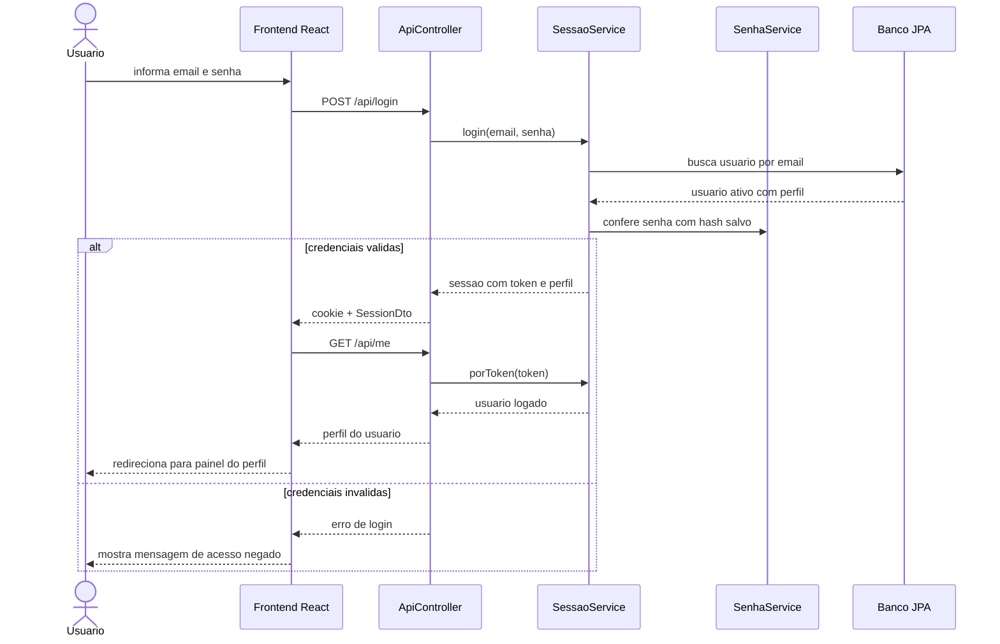
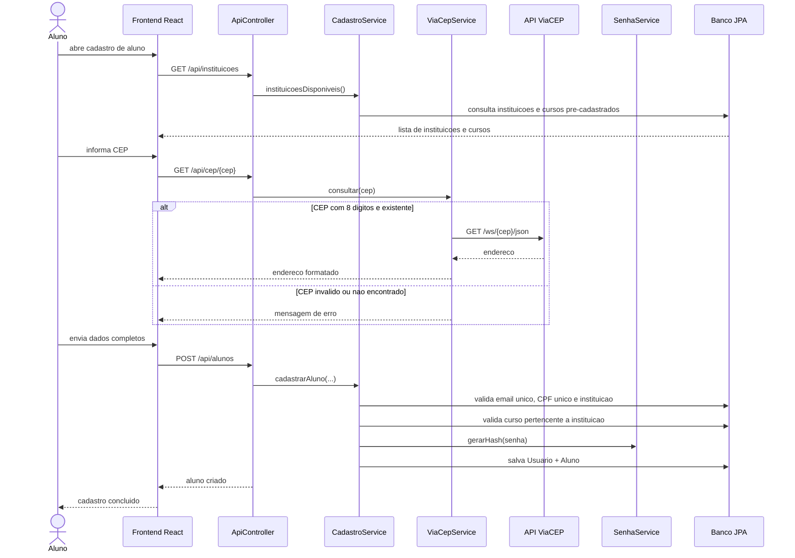
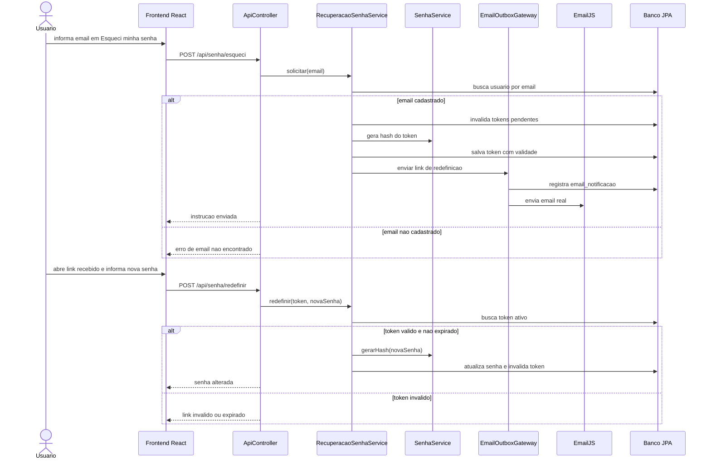
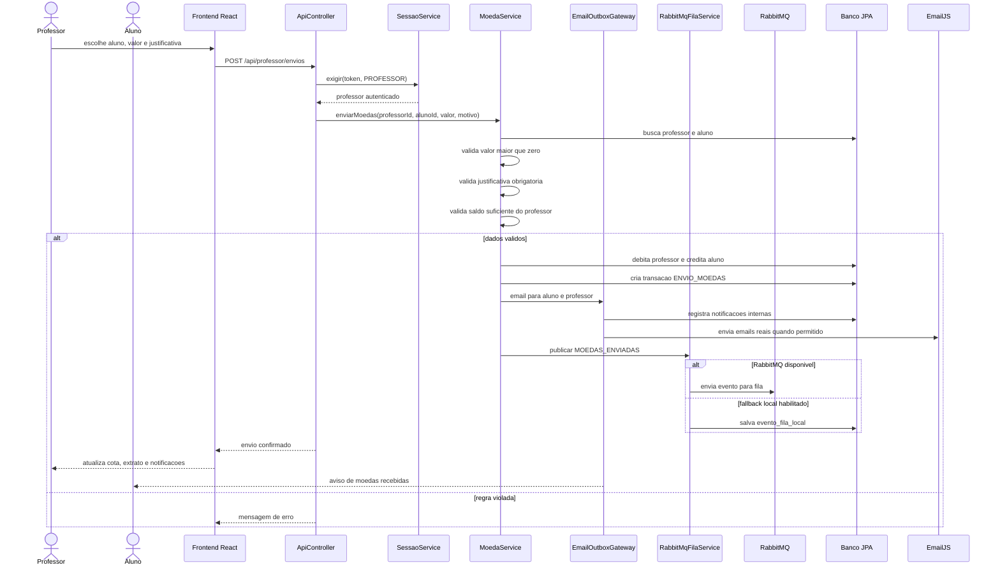
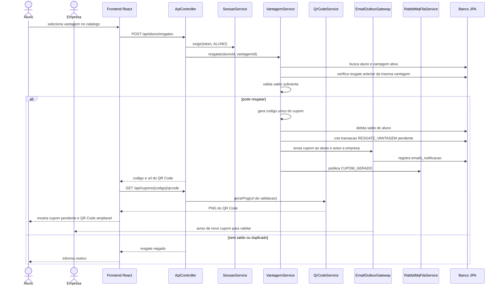
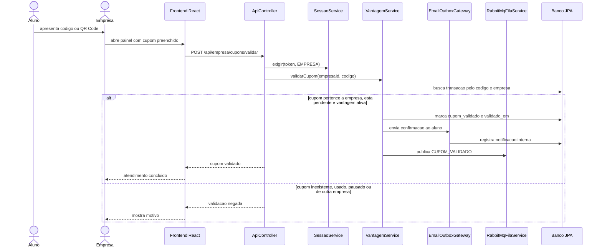
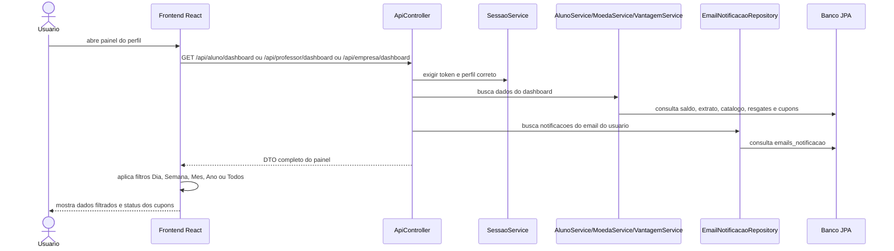

# DiagramaDeSequencia - release 2-3

Artefato das Releases 2 e 3 do Valoriza Ae.

Este arquivo consolida os principais fluxos de sequencia implementados nas Releases 2 e 3.

## Sequencia - login e acesso por perfil



---

## Sequencia - cadastro de aluno com instituicao, curso e ViaCEP



---

## Sequencia - recuperacao de senha por EmailJS



---

## Sequencia - envio de moedas pelo professor



---

## Sequencia - resgate de vantagem com cupom e QR Code



---

## Sequencia - validacao de cupom pela empresa



---

## Sequencia - gestao de vantagem pela empresa

```mermaid
sequenceDiagram
    actor Empresa
    actor Aluno
    participant React as Frontend React
    participant API as ApiController
    participant Sessao as SessaoService
    participant Vantagens as VantagemService
    participant Email as EmailOutboxGateway
    participant Fila as RabbitMqFilaService
    participant DB as Banco JPA

    Empresa->>React: cria ou edita vantagem
    React->>API: POST/PUT /api/empresa/vantagens
    API->>Sessao: exigir(token, EMPRESA)
    API->>Vantagens: cadastrar ou atualizar
    Vantagens->>Vantagens: valida titulo, descricao, foto e custo
    Vantagens->>DB: salva vantagem vinculada a empresa
    API-->>React: catalogo atualizado

    Empresa->>React: pausa ou reativa vantagem
    React->>API: PUT /api/empresa/vantagens/{id}/status
    API->>Vantagens: alterarStatus(empresaId, id, ativa)
    Vantagens->>DB: confirma que a vantagem pertence a empresa
    Vantagens->>DB: atualiza status
    Vantagens->>DB: localiza cupons pendentes da vantagem
    alt possui cupons pendentes
        Vantagens->>Email: notifica alunos afetados
        Vantagens->>Fila: publica CUPOM_DESATIVADO ou CUPOM_REATIVADO
        Email-->>Aluno: aviso sobre status do cupom
    end
    API-->>React: status atualizado

    Empresa->>React: solicita exclusao
    React->>API: DELETE /api/empresa/vantagens/{id}
    API->>Vantagens: excluir(empresaId, id)
    Vantagens->>DB: verifica historico de transacoes
    alt sem historico
        Vantagens->>DB: remove vantagem
        API-->>React: exclusao concluida
    else possui cupom ou resgate
        API-->>React: exclusao bloqueada; pausar vantagem
    end
```

---

## Sequencia - dashboards, extratos e filtros por periodo


