# DiagramaDeCasosDeUso - release 2-3

Artefato das Releases 2 e 3 do Valoriza Ae.

Este diagrama mostra os atores, os principais casos de uso adicionados nas Releases 2 e 3 e as integracoes externas envolvidas.

## Diagrama de casos de uso

```mermaid
flowchart LR
    Aluno(["Aluno"])
    Professor(["Professor"])
    Empresa(["Empresa parceira"])
    Sistema(["Sistema Valoriza Ae"])
    EmailJS(["EmailJS"])
    RabbitMQ(["RabbitMQ"])
    ViaCEP(["ViaCEP"])

    subgraph Conta["Conta, cadastro e seguranca"]
        UCLogin["Entrar no sistema"]
        UCMe["Identificar usuario logado"]
        UCLogout["Sair do sistema"]
        UCCadastroAluno["Cadastrar aluno"]
        UCCadastroEmpresa["Cadastrar empresa parceira"]
        UCSelecionarInstituicao["Selecionar instituicao pre-cadastrada"]
        UCSelecionarCurso["Selecionar curso da instituicao"]
        UCConsultarCep["Consultar endereco por CEP"]
        UCRecuperarSenha["Solicitar recuperacao de senha"]
        UCRedefinirSenha["Redefinir senha por link"]
        UCRestricaoPerfil["Bloquear acesso fora do perfil"]
    end

    subgraph AlunoUC["Release 2 e 3 - Aluno"]
        UCDashboardAluno["Ver saldo, extrato, notificacoes e cupons"]
        UCExtratoAluno["Filtrar extrato por periodo"]
        UCCatalogo["Consultar catalogo de vantagens"]
        UCFiltrarVantagens["Filtrar vantagens disponiveis, adquiridas e metas"]
        UCResgatar["Resgatar vantagem"]
        UCBloquearDuplicado["Impedir resgate duplicado da mesma vantagem"]
        UCVerCupom["Ver cupom, status e QR Code"]
        UCAmpliarQr["Ampliar QR Code do cupom"]
    end

    subgraph ProfessorUC["Release 2 e 3 - Professor"]
        UCDashboardProfessor["Ver cota, alunos, extrato e notificacoes"]
        UCExtratoProfessor["Filtrar extrato por periodo"]
        UCCreditoSemestral["Creditar cota semestral"]
        UCSelecionarAluno["Buscar e selecionar aluno"]
        UCEnviarMoedas["Enviar moedas com justificativa"]
        UCValidarSaldoProfessor["Validar saldo e motivo do envio"]
        UCEmailProfessor["Receber confirmacao do envio"]
    end

    subgraph EmpresaUC["Release 2 e 3 - Empresa"]
        UCDashboardEmpresa["Ver catalogo, cupons e historico"]
        UCCadastrarVantagem["Cadastrar vantagem com imagem, custo e descricao"]
        UCEditarVantagem["Editar vantagem"]
        UCPausarVantagem["Pausar vantagem"]
        UCReativarVantagem["Reativar vantagem"]
        UCExcluirVantagem["Excluir vantagem sem historico de cupom"]
        UCNotificarCupomPendente["Notificar aluno com cupom pendente"]
        UCConsultarCupom["Consultar cupom por codigo"]
        UCValidarCupom["Validar cupom do aluno"]
        UCBloquearCupomInvalido["Bloquear cupom usado, pausado ou de outra empresa"]
    end

    subgraph Integracoes["Release 3 - Integracoes e rastreabilidade"]
        UCEmail["Enviar email real e registrar notificacao"]
        UCQrCode["Gerar QR Code do cupom"]
        UCFila["Publicar evento operacional"]
        UCFallback["Persistir evento local em desenvolvimento"]
        UCAuditoria["Manter rastreabilidade em extratos e notificacoes"]
    end

    Aluno --> UCLogin
    Aluno --> UCCadastroAluno
    Aluno --> UCRecuperarSenha
    Aluno --> UCDashboardAluno
    Aluno --> UCExtratoAluno
    Aluno --> UCCatalogo
    Aluno --> UCFiltrarVantagens
    Aluno --> UCResgatar
    Aluno --> UCVerCupom
    Aluno --> UCAmpliarQr

    Professor --> UCLogin
    Professor --> UCRecuperarSenha
    Professor --> UCDashboardProfessor
    Professor --> UCExtratoProfessor
    Professor --> UCCreditoSemestral
    Professor --> UCSelecionarAluno
    Professor --> UCEnviarMoedas

    Empresa --> UCLogin
    Empresa --> UCCadastroEmpresa
    Empresa --> UCRecuperarSenha
    Empresa --> UCDashboardEmpresa
    Empresa --> UCCadastrarVantagem
    Empresa --> UCEditarVantagem
    Empresa --> UCPausarVantagem
    Empresa --> UCReativarVantagem
    Empresa --> UCExcluirVantagem
    Empresa --> UCConsultarCupom
    Empresa --> UCValidarCupom

    UCCadastroAluno --> UCSelecionarInstituicao
    UCCadastroAluno --> UCSelecionarCurso
    UCCadastroAluno --> UCConsultarCep
    UCCadastroEmpresa --> UCConsultarCep
    UCConsultarCep --> ViaCEP
    UCRecuperarSenha --> UCEmail
    UCRedefinirSenha --> UCEmail
    UCEmail --> EmailJS

    UCEnviarMoedas --> UCValidarSaldoProfessor
    UCEnviarMoedas --> UCEmail
    UCEnviarMoedas --> UCFila
    UCEnviarMoedas --> UCAuditoria
    UCResgatar --> UCBloquearDuplicado
    UCResgatar --> UCQrCode
    UCResgatar --> UCEmail
    UCResgatar --> UCFila
    UCValidarCupom --> UCBloquearCupomInvalido
    UCValidarCupom --> UCEmail
    UCValidarCupom --> UCFila
    UCPausarVantagem --> UCNotificarCupomPendente
    UCReativarVantagem --> UCNotificarCupomPendente
    UCNotificarCupomPendente --> UCEmail
    UCNotificarCupomPendente --> UCFila
    UCFila --> RabbitMQ
    UCFila --> UCFallback
    Sistema --> UCMe
    Sistema --> UCLogout
    Sistema --> UCRestricaoPerfil
```

## Cobertura

- Release 2: cadastro, acesso por perfil, envio de moedas, extratos, catalogo, vantagens e validacao de cupons.
- Release 3: EmailJS, QR Code, RabbitMQ, ViaCEP, recuperacao de senha e rastreabilidade de eventos.
