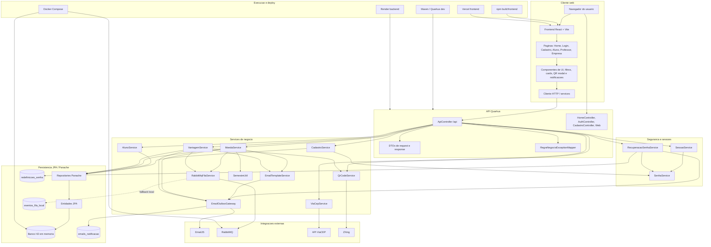

# DiagramaDeComponentes - release 2-3

Artefato das Releases 2 e 3 do Valoriza Ae.

Este diagrama apresenta os componentes internos e externos que participam dos fluxos adicionados nas Releases 2 e 3.

## Diagrama de componentes

## Componentes cobertos

- Frontend React: navegacao por perfil, paineis, formularios, filtros, catalogo, cupom e QR Code.
- Backend Quarkus: controllers, services, seguranca, DTOs, exception mapper e regras de negocio.
- Persistencia: entidades JPA, repositories Panache, outbox de email, tokens de senha e fallback de fila.
- Integracoes: EmailJS, RabbitMQ, ViaCEP e ZXing.
