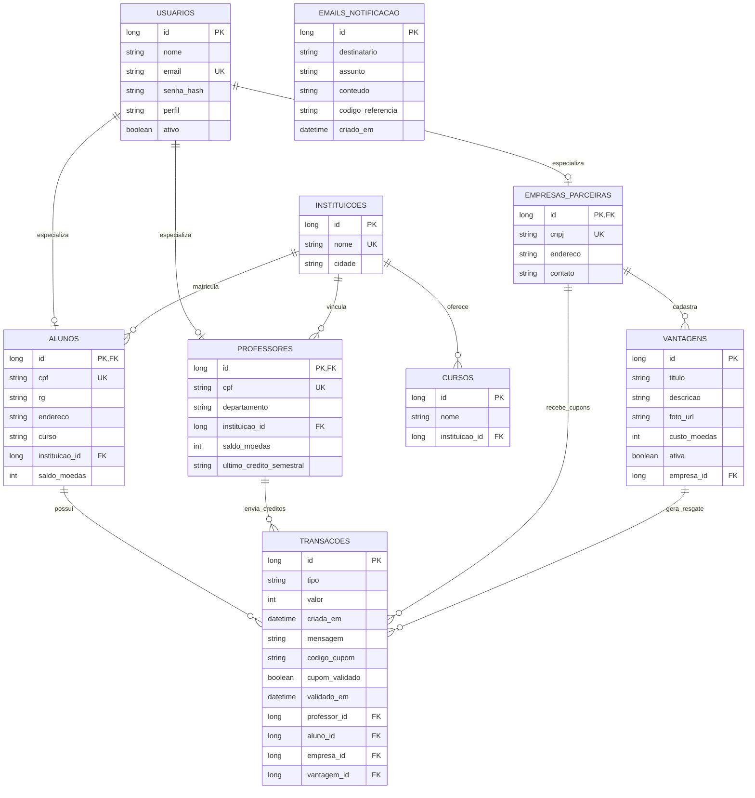

# Diagrama ER e estrategia de acesso a dados

Este documento descreve o modelo de dados do Valoriza Ae e a estrategia usada para persistencia no banco.

## Diagrama Entidade-Relacionamento



## Principais regras representadas no modelo

- `Usuario` e a entidade base de autenticacao. `Aluno`, `Professor` e `EmpresaParceira` herdam seus dados de acesso por uma estrategia de heranca com tabelas separadas.
- `Aluno` pertence a uma `Instituicao` e informa um `curso`. O curso enviado no cadastro e validado contra a lista de `Curso` daquela instituicao; no modelo atual o nome do curso fica gravado no aluno, sem chave estrangeira direta para `Curso`.
- `Professor` tambem pertence a uma `Instituicao`, possui CPF, departamento, saldo de moedas e controle do ultimo credito semestral.
- `EmpresaParceira` cadastra `Vantagem`; cada vantagem tem descricao, imagem, custo em moedas e status ativo/inativo.
- `Transacao` registra os eventos financeiros e operacionais do sistema: credito semestral, envio de moedas e resgate de vantagem.
- Quando uma vantagem e resgatada, a transacao recebe `codigoCupom`; a empresa parceira confirma o uso marcando `cupomValidado` e `validadoEm`.
- `EmailNotificacao` funciona como caixa de saida/auditoria de mensagens enviadas. Ela guarda destinatario por email e codigo de referencia, sem chave estrangeira obrigatoria para usuario.

## Estrategia de acesso ao banco de dados

O projeto usa ORM com Jakarta Persistence/JPA, Hibernate ORM e Quarkus Panache.

### ORM

As classes do pacote `br.com.sistemamoedas.domain` sao entidades JPA anotadas com `@Entity` e `@Table`. O Hibernate mapeia essas classes para tabelas relacionais e gerencia criacao, consulta e atualizacao dos registros.

Entidades principais:

- `Usuario`
- `Aluno`
- `Professor`
- `EmpresaParceira`
- `Instituicao`
- `Curso`
- `Vantagem`
- `Transacao`
- `EmailNotificacao`

### Heranca

`Usuario` usa:

```java
@Inheritance(strategy = InheritanceType.JOINED)
```

Com isso, os campos comuns ficam em `usuarios`, enquanto os dados especificos ficam em `alunos`, `professores` e `empresas_parceiras`. Cada tabela filha compartilha o mesmo `id` da tabela `usuarios`.

### Repositories como DAO

O projeto implementa a ideia do padrao DAO por meio de repositories Panache. Cada repository encapsula consultas e operacoes de persistencia relacionadas a uma entidade.

Repositories existentes:

- `AlunoRepository`
- `ProfessorRepository`
- `EmpresaParceiraRepository`
- `UsuarioRepository`
- `InstituicaoRepository`
- `CursoRepository`
- `VantagemRepository`
- `TransacaoRepository`
- `EmailNotificacaoRepository`

Exemplo de responsabilidade:

- `CursoRepository` busca cursos por instituicao e valida se um curso pertence a uma instituicao.
- `TransacaoRepository` concentra consultas de extrato, cupom e historico.
- `VantagemRepository` busca vantagens disponiveis e vantagens de uma empresa.

### Camada de servico

As regras de negocio ficam nos services, nao nos controllers:

- `CadastroService`: cadastro de aluno/empresa e validacao de instituicao/curso.
- `MoedaService`: credito semestral, envio de moedas e extrato do professor.
- `VantagemService`: cadastro de vantagens, resgate, bloqueio de resgate duplicado e validacao de cupom.
- `AlunoService`: dados e extrato do aluno.

### Transacoes

Operacoes que alteram dados usam `@Transactional`, garantindo atomicidade. Exemplos:

- cadastrar aluno;
- cadastrar empresa;
- enviar moedas;
- creditar semestre;
- resgatar vantagem;
- validar cupom;
- cadastrar, editar ou desativar vantagem.

### Banco de dados

O ambiente atual usa H2 em memoria, configurado em `src/main/resources/application.properties`:

```properties
quarkus.datasource.db-kind=h2
quarkus.datasource.jdbc.url=jdbc:h2:mem:valoriza-ae;DB_CLOSE_DELAY=-1;DB_CLOSE_ON_EXIT=FALSE
quarkus.hibernate-orm.database.generation=update
```

Para testes, o projeto usa outro banco H2 em memoria com recriacao do schema:

```properties
%test.quarkus.datasource.jdbc.url=jdbc:h2:mem:valoriza-ae-test;DB_CLOSE_DELAY=-1
%test.quarkus.hibernate-orm.database.generation=drop-and-create
```

Essa estrategia deixa o projeto simples para rodar em laboratorio, mas a camada ORM permite trocar para PostgreSQL/MySQL com baixa alteracao de codigo, ajustando principalmente as propriedades do datasource.
