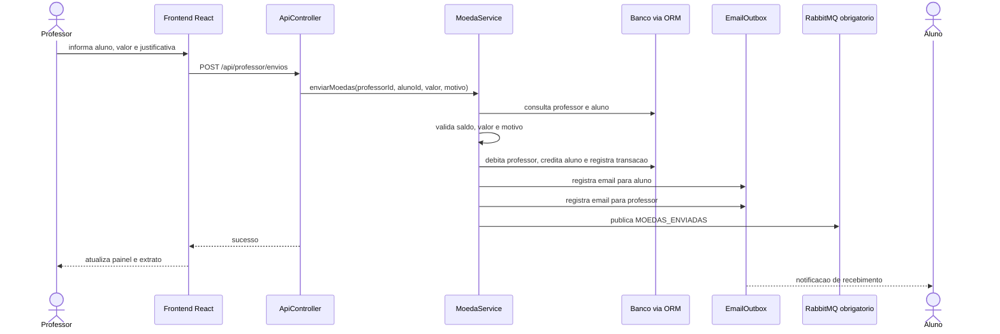
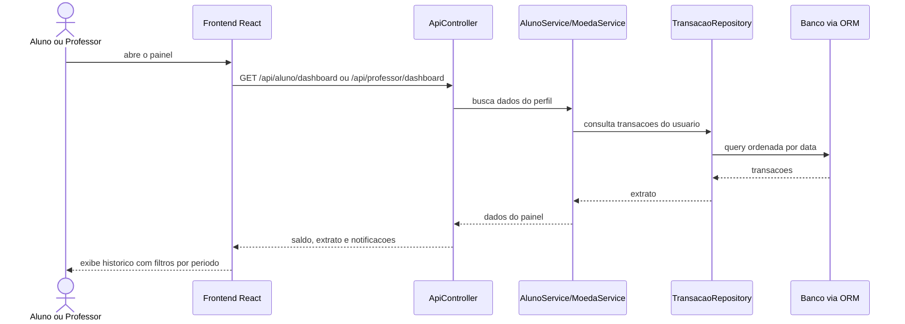
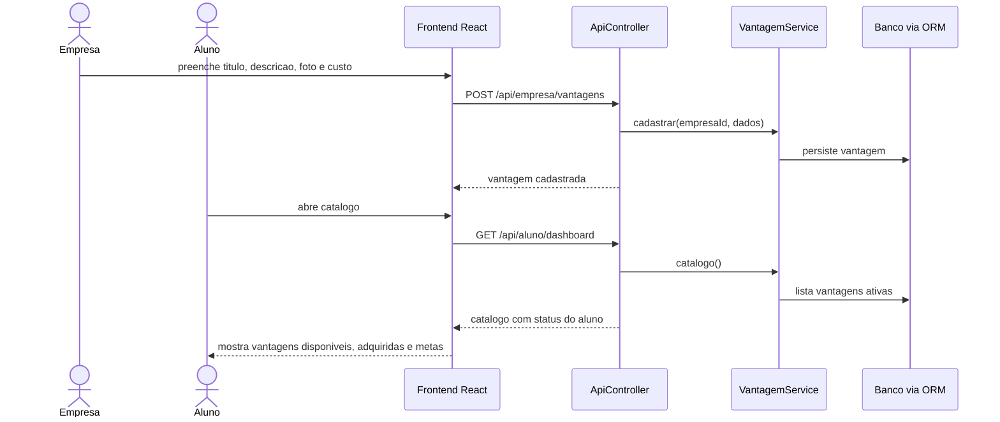
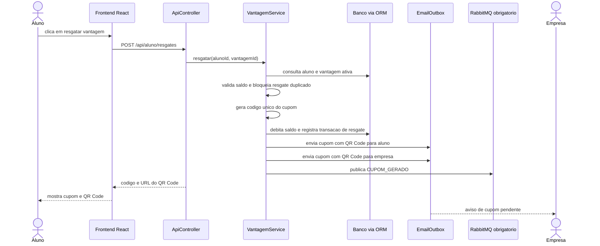
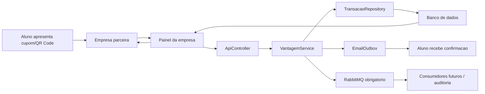
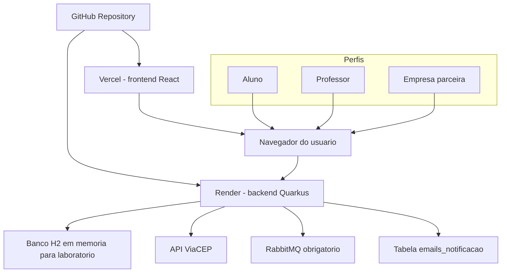

# Release 2 e Release 3 - diagramas e rastreabilidade

Este documento consolida os artefatos pedidos nas Releases 2 e 3 do sistema Valoriza Ae.

## Release 2 - requisitos cobertos

- Envio de moedas pelo professor com saldo suficiente e justificativa obrigatoria.
- Extrato do professor com envios e credito semestral.
- Extrato do aluno com recebimentos, resgates, cupons e status.
- Email de confirmacao para o aluno que recebeu moedas.
- Email de confirmacao para o professor que enviou moedas.
- Cadastro, edicao, pausa/publicacao e exclusao segura de vantagens pela empresa parceira.
- Listagem de vantagens para o aluno, com filtro por disponibilidade, adquiridas e metas.
- Troca de vantagem pelo aluno com desconto imediato do saldo.
- Bloqueio de resgate duplicado da mesma vantagem pelo mesmo aluno.

## Release 3 - requisitos cobertos

- Email de cupom para aluno e empresa parceira.
- Codigo de cupom unico gerado automaticamente pelo sistema.
- QR Code unico para cada cupom.
- QR Code escaneavel como URL de validacao: abre o painel da empresa com o cupom preenchido.
- Validacao do cupom pela empresa dona da vantagem.
- Fila RabbitMQ obrigatoria para eventos de envio de moedas, cupom gerado, cupom validado e mudancas de status.
- Configuracao de deploy em Render para o backend Quarkus.
- Configuracao de deploy em Vercel para o frontend React.

## Diagrama de sequencia - enviar moedas

## Diagrama de sequencia - consultar extrato

## Diagrama de sequencia - cadastrar/listar vantagem

## Diagrama de sequencia - trocar vantagem

## Diagrama de comunicacao - validacao de cupom

## Diagrama de implantacao

## Estrategia de implantacao

- Em laboratorio, rode tudo pelo Quarkus em `http://localhost:8080`.
- No Render, use o `Dockerfile` e o `render.yaml` da pasta do projeto.
- No Vercel, use o `vercel.json` e configure `VITE_API_BASE_URL` apontando para a URL do backend no Render.
- Para cookies entre Vercel e Render, o backend usa `VALORIZA_COOKIE_SAME_SITE=None` e `VALORIZA_COOKIE_SECURE=true` no ambiente de nuvem.
- Configure um RabbitMQ acessivel no ambiente de deploy; sem ele, operacoes que publicam eventos sao bloqueadas.
- O banco H2 em memoria atende ao prototipo academico; em producao real, a troca recomendada e PostgreSQL.
