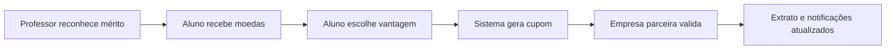

<h1 align="center">Valoriza Aê</h1>

<p align="center">
  Plataforma de moeda estudantil para reconhecimento acadêmico, resgate de benefícios e validação de cupons por parceiros.
</p>

<p align="center">
  
  
  
  
  
  
</p>

---

## Sobre o Projeto

O **Valoriza Aê** é um sistema acadêmico em que professores reconhecem boas entregas de alunos por meio de moedas virtuais. Os alunos acumulam essas moedas e podem resgatar benefícios cadastrados por empresas parceiras. Cada resgate gera um cupom, e a empresa parceira valida esse cupom no atendimento para confirmar a entrega do benefício.

O projeto atende às histórias de usuário do sistema de moeda estudantil e foi evoluído com uma interface em estilo SaaS, regras de negócio mais completas, catálogo com imagens, extratos filtráveis, notificações e controle real do ciclo de vida dos cupons.

---

## Fluxo Principal



---

## Perfis do Sistema

### Aluno

O aluno usa o sistema para acompanhar seu reconhecimento acadêmico e transformar moedas em benefícios reais.

Principais recursos:

- Cadastro com nome, email, senha, CPF, RG, endereço, instituição e curso.
- Seleção de instituição pré-cadastrada.
- Seleção de curso conforme a instituição escolhida.
- Dashboard com saldo, moedas recebidas, cupons validados e jornada do aluno.
- Catálogo de vantagens com imagem, custo em moedas, descrição e instrução de uso do cupom.
- Resgate de vantagens com geração automática de cupom.
- Bloqueio para não resgatar a mesma vantagem duas vezes.
- Extrato com filtros por hoje, semana, mês, ano e todos.
- Notificações registradas quando recebe moedas, resgata cupom, tem cupom validado ou tem cupom temporariamente desativado.

### Professor

O professor é pré-cadastrado pela instituição parceira e usa moedas para reconhecer entregas reais dos alunos.

Principais recursos:

- Perfil vinculado explicitamente a uma instituição.
- Cadastro institucional com nome, CPF, departamento e instituição.
- Cota semestral de 1.000 moedas.
- Envio de moedas para alunos com justificativa obrigatória.
- Sugestões rápidas de justificativa.
- Visualização de alunos, saldos e histórico de envios.
- Extrato e notificações com filtros por período.

### Empresa Parceira

A empresa parceira cadastra benefícios e valida os cupons apresentados pelos alunos.

Principais recursos:

- Cadastro de empresa parceira.
- Criação e edição de vantagens com título, descrição, foto, custo em moedas e status.
- Preview da vantagem antes de publicar.
- Catálogo parceiro com vantagens publicadas e pausadas.
- Validação de cupom pelo código apresentado pelo aluno.
- Fila de cupons recentes com status pendente, validado ou desativado.
- Notificações e histórico de resgates recebidos.

---

## Regras de Negócio

- Cada usuário acessa apenas o painel do próprio perfil.
- Aluno deve informar CPF, RG, endereço, instituição de ensino e curso.
- As instituições participantes são pré-cadastradas.
- Os cursos são pré-cadastrados por instituição.
- O sistema valida se o curso escolhido pertence à instituição selecionada.
- Professores são pré-cadastrados e vinculados a uma instituição.
- Cada professor possui CPF, departamento, instituição e saldo de moedas.
- O professor recebe 1.000 moedas por semestre.
- Envio de moedas exige aluno válido, saldo suficiente, valor positivo e justificativa.
- O aluno visualiza saldo, extrato, cupons e notificações.
- A empresa cadastra vantagens com descrição, imagem, custo e status.
- Cada resgate gera um cupom único.
- O aluno não pode resgatar a mesma vantagem duas vezes.
- A empresa valida o cupom para confirmar a entrega do benefício.
- Cupom pendente de uma vantagem pausada fica temporariamente desativado.
- Cupom desativado não pode ser validado até a vantagem ser publicada novamente.
- Vantagem com cupom ou resgate vinculado não pode ser excluída, apenas pausada.
- Vantagem sem cupom/resgate vinculado pode ser excluída.
- Emails são registrados como notificações dentro do sistema.

---

## Vantagens, Cupons e Status

No sistema, uma **vantagem** é o benefício cadastrado pela empresa. Quando o aluno resgata uma vantagem, o sistema gera um **cupom**.

Status importantes:

| Status | Significado |
| --- | --- |
| Publicada | A vantagem aparece no catálogo dos alunos e pode ser resgatada. |
| Pausada | A vantagem não aparece para novos resgates. |
| Cupom pendente | O aluno resgatou, mas a empresa ainda não validou. |
| Cupom validado | A empresa confirmou o atendimento. |
| Cupom desativado | A vantagem foi pausada e o cupom pendente não pode ser usado até republicação. |

---

## Tecnologias

| Camada | Tecnologia |
| --- | --- |
| Back-end | Java 17, Quarkus 3.15 |
| Front-end | React, Vite |
| Renderização inicial | Qute como shell HTML da SPA |
| Persistência | Hibernate ORM com Panache |
| Banco de dados | H2 em memória |
| Testes | JUnit 5, Quarkus Test |
| Build | Maven e npm |
| Ícones | Lucide React |

---

## Arquitetura

O projeto segue uma organização em camadas:

```text
Código
├── frontend
│   └── src
│       ├── main.jsx
│       └── styles.css
├── src
│   ├── main
│   │   ├── java/br/com/sistemamoedas
│   │   │   ├── app
│   │   │   ├── controller
│   │   │   ├── domain
│   │   │   ├── repository
│   │   │   ├── security
│   │   │   └── service
│   │   └── resources
│   │       ├── META-INF/resources/react
│   │       ├── templates
│   │       └── application.properties
│   └── test
│       └── java/br/com/sistemamoedas
└── docs
    ├── historias-usuario-expandidas.md
    └── diagrama-er-acesso-dados.md
```

Responsabilidades principais:

- `controller`: rotas web, API REST e integração com sessão.
- `domain`: entidades JPA e enums do domínio.
- `repository`: repositories Panache, funcionando como camada DAO.
- `service`: regras de negócio.
- `security`: login, sessão e senha.
- `app`: dados iniciais do sistema.
- `frontend`: aplicação React.
- `templates`: shells Qute que carregam a aplicação React.

---

## Persistência e Banco de Dados

O projeto usa **Jakarta Persistence/JPA**, **Hibernate ORM** e **Quarkus Panache**.

Entidades principais:

- `Usuario`
- `Aluno`
- `Professor`
- `EmpresaParceira`
- `Instituicao`
- `Curso`
- `Vantagem`
- `Transacao`
- `EmailNotificacao`

O banco em desenvolvimento é H2 em memória:

```properties
quarkus.datasource.db-kind=h2
quarkus.datasource.jdbc.url=jdbc:h2:mem:valoriza-ae;DB_CLOSE_DELAY=-1;DB_CLOSE_ON_EXIT=FALSE
quarkus.hibernate-orm.database.generation=update
```

Nos testes, o schema é recriado automaticamente:

```properties
%test.quarkus.datasource.jdbc.url=jdbc:h2:mem:valoriza-ae-test;DB_CLOSE_DELAY=-1
%test.quarkus.hibernate-orm.database.generation=drop-and-create
```

---

## Como Rodar no VS Code

Abra o terminal na raiz do projeto:

```powershell
cd C:\Users\Pichau\Desktop\Sistema-De-Moedas
```

Entre na pasta do código:

```powershell
cd .\Código
```

Instale as dependências do front-end:

```powershell
npm install
```

Gere o bundle React:

```powershell
npm run build:frontend
```

Inicie o servidor Quarkus:

```powershell
mvn quarkus:dev
```

Acesse:

```text
http://localhost:8080
```

---

## Usuários de Demonstração

| Perfil | Email | Senha |
| --- | --- | --- |
| Aluno | aluno@moedas.com | 123456 |
| Professor | professor@moedas.com | 123456 |
| Empresa Parceira | empresa@moedas.com | 123456 |

---

## Comandos Úteis

Compilar o front-end:

```powershell
npm run build:frontend
```

Rodar os testes:

```powershell
mvn test
```

Gerar pacote da aplicação:

```powershell
mvn package
```

Compilar o back-end sem rodar testes:

```powershell
mvn -DskipTests compile
```

---

## Documentação

Arquivos complementares:

- `Código/docs/historias-usuario-expandidas.md`
- `Código/docs/diagrama-er-acesso-dados.md`

O arquivo de diagrama inclui:

- Diagrama Entidade-Relacionamento.
- Estratégia de acesso ao banco.
- Uso de ORM.
- Uso de repositories como padrão DAO.

---

## Validação Atual

Última validação esperada:

```powershell
npm run build:frontend
mvn test
```

Resultado esperado:

```text
Tests run: 9, Failures: 0, Errors: 0, Skipped: 0
```

---

## Observações

- Os dados iniciais ficam em `Código/src/main/java/br/com/sistemamoedas/app/DadosIniciais.java`.
- O sistema usa H2 em memória, então os dados são recriados ao reiniciar a aplicação.
- Para alterações no React aparecerem no navegador, rode `npm run build:frontend`.
- O arquivo `README.md` principal fica na raiz `C:\Users\Pichau\Desktop\Sistema-De-Moedas`.
