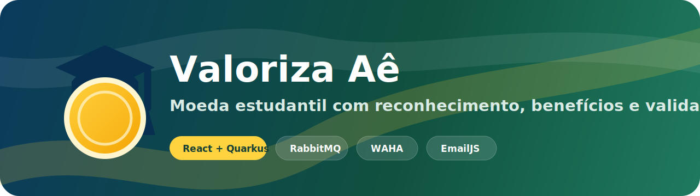
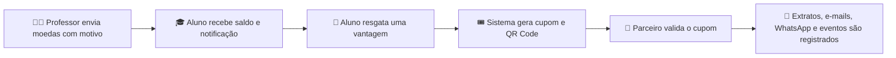

<p align="center">
  
</p>

---

## 🧭 Atalhos Rápidos

Use esta navegação para ir direto ao ponto certo do projeto. Cada item indica **por que acessar** aquela seção e **o que você encontra lá**.

| Atalho | Quando usar | O que explica |
| --- | --- | --- |
| ✨ [Visão Geral](#visao-geral) | Para entender rapidamente a proposta do sistema. | Resume o Valoriza Aê, os perfis e o objetivo da moeda estudantil. |
| 🔄 [Fluxo Principal](#fluxo-principal) | Para visualizar o caminho completo da moeda. | Mostra como o reconhecimento vira saldo, cupom, QR Code e validação. |
| 👥 [Perfis do Sistema](#perfis-do-sistema) | Para saber o que aluno, professor e parceiro fazem. | Detalha responsabilidades e funcionalidades de cada perfil. |
| 🚀 [Funcionalidades Principais](#funcionalidades-principais) | Para conferir o que já existe no produto. | Lista recursos implementados no front, back, integrações e regras práticas. |
| ▶️ [Como Rodar o Sistema Completo](#como-rodar) | Para iniciar o projeto no VS Code. | Mostra o comando principal e o que o script faz automaticamente. |
| 💬 [WAHA / WhatsApp](#waha-whatsapp) | Para configurar e testar o bot do WhatsApp. | Explica Docker, dashboard, API key, sessão, QR Code, Worker e erros comuns. |
| 🐇 [RabbitMQ](#rabbitmq) | Para entender a fila de eventos. | Mostra eventos publicados e como acessar o painel da fila. |
| 📱 [QR Code dos Cupons](#qr-code) | Para entender o resgate e validação do benefício. | Explica o endpoint do QR Code e como o parceiro valida o cupom. |
| 📍 [ViaCEP](#viacep) | Para conferir a integração de endereço. | Mostra o endpoint de CEP usado nos cadastros. |
| ✉️ [EmailJS](#emailjs) | Para configurar envio real de e-mails. | Explica template, campos dinâmicos e liberação de envio pelo painel EmailJS. |
| 🔐 [Acessos Iniciais](#acessos-iniciais) | Para entrar no sistema em ambiente local. | Lista e-mail e senha dos perfis de demonstração. |
| ⚙️ [Configurações Importantes](#configuracoes) | Para ajustar variáveis de ambiente. | Mostra variáveis para WhatsApp, EmailJS, URL pública e testes locais. |
| 🛠️ [Comandos Úteis](#comandos-uteis) | Para trabalhar no projeto no dia a dia. | Reúne comandos de build, testes, execução local e pacote. |
| ✅ [Validação](#validacao) | Para conferir se está tudo funcionando. | Mostra os comandos de teste esperados antes de entregar ou commitar. |

---

<a id="visao-geral"></a>

## ✨ Visão Geral

O **Valoriza Aê** é um sistema de moeda estudantil com três perfis principais: **aluno**, **professor** e **empresa parceira**.

A ideia é simples: professores reconhecem boas participações com moedas, alunos acompanham saldo e resgatam benefícios, e parceiros validam cupons para confirmar que o benefício foi realmente usado.

O projeto inclui front-end React, back-end Quarkus, RabbitMQ, QR Code, ViaCEP, EmailJS, WhatsApp via WAHA, recuperação de senha, validação por perfil e documentação com diagramas das releases.

---

<a id="fluxo-principal"></a>

## 🔄 Fluxo Principal



---

<a id="perfis-do-sistema"></a>

## 👥 Perfis do Sistema

### 🎓 Aluno

O aluno usa o Valoriza Aê para acompanhar seu reconhecimento acadêmico e trocar moedas por benefícios.

- Cadastro com nome, e-mail, CPF, RG, endereço, instituição e curso.
- Instituições e cursos pré-cadastrados.
- Curso filtrado pela instituição escolhida.
- Painel com saldo, extrato, notificações, cupons e vantagens.
- Resgate de vantagem com cupom único e QR Code.
- Bloqueio para não comprar a mesma vantagem novamente.
- Recuperação de senha por e-mail.
- Atendimento via WhatsApp depois do login.

### 👩‍🏫 Professor

O professor já vem pré-cadastrado pela instituição parceira.

- Vínculo explícito com a instituição.
- Dados: nome, CPF, departamento e instituição.
- Cota semestral de moedas.
- Envio de moedas com justificativa obrigatória.
- Extrato e notificações com filtro por período.
- Confirmação por e-mail, notificação interna e WhatsApp.
- Comandos pelo WhatsApp para consultar cota, alunos e enviar moedas.

### 🏪 Empresa Parceira

A empresa parceira cadastra benefícios e confirma o uso dos cupons.

- Cadastro da empresa.
- Criação, edição, pausa, reativação e exclusão de vantagens.
- Vantagens com título, descrição, imagem, custo em moedas e status.
- Validação de cupom por código ou QR Code.
- Histórico de resgates recebidos.
- Notificações sobre cupons pendentes, validados, pausados ou reativados.
- Comandos pelo WhatsApp para consultar pendências e validar cupons.

---

<a id="funcionalidades-principais"></a>

## 🚀 Funcionalidades Principais

- 🔐 Login por perfil com acesso restrito.
- 💻 Interface React em estilo SaaS.
- 📊 Painéis separados para aluno, professor e empresa.
- 🎓 Cadastro de aluno com instituição e curso pré-cadastrados.
- 🏫 Professor pré-cadastrado por instituição.
- 🪙 Envio de moedas com justificativa.
- 🎁 Catálogo de vantagens com imagem, descrição e custo.
- 🎟️ Cupom único por resgate.
- 📱 QR Code para apresentar ao parceiro.
- ✅ Validação de cupom pela empresa.
- 🛡️ Bloqueio de cupom já usado.
- 🔔 Notificação quando vantagem é pausada ou reativada.
- 📄 Extratos e notificações com filtros.
- ✉️ EmailJS para notificações e recuperação de senha.
- 💬 WhatsApp via WAHA com bot por perfil.
- 📍 ViaCEP para preenchimento de endereço.
- 🐇 RabbitMQ para rastrear eventos importantes.

---

## 🧩 Tecnologias

| Área | Tecnologia |
| --- | --- |
| Back-end | Java 17, Quarkus 3.15 |
| Front-end | React 18, Vite |
| UI | CSS organizado por telas, Lucide React |
| Banco local | H2 em memória |
| Persistência | JPA, Hibernate ORM, Panache |
| Mensageria | RabbitMQ |
| WhatsApp | WAHA |
| QR Code | ZXing |
| E-mail | EmailJS |
| CEP | ViaCEP |
| Testes | JUnit 5, Quarkus Test, Rest Assured |
| Build | Maven, npm |

---

## 📁 Estrutura do Projeto

```text
Sistema-De-Moedas
|-- README.md
|-- Código
|   |-- frontend
|   |   `-- src
|   |       |-- components
|   |       |-- config
|   |       |-- hooks
|   |       |-- pages
|   |       |-- services
|   |       |-- styles
|   |       `-- utils
|   |-- src
|   |   |-- main
|   |   |   |-- java/br/com/sistemamoedas
|   |   |   |   |-- app
|   |   |   |   |-- controller
|   |   |   |   |-- domain
|   |   |   |   |-- repository
|   |   |   |   |-- security
|   |   |   |   `-- service
|   |   |   `-- resources
|   |   `-- test
|   |-- docker-compose.yml
|   |-- Dockerfile
|   |-- start.ps1
|   |-- start-local.ps1
|   `-- start-docker.ps1
|-- Artefatos
|   |-- DiagramaDeComunicacao
|   |-- DiagramaDeDados
|   |-- DiagramaDeImplantacao
|   |-- DiagramaDeSequencia
|   `-- HistoriaDeUsuario
`-- docs
    `-- readme
```

---

<a id="como-rodar"></a>

## ▶️ Como Rodar o Sistema Completo

Use este caminho no terminal do VS Code:

```powershell
cd "C:\Users\Pichau\Desktop\Sistema-De-Moedas\Código"
```

Instale as dependências do front-end:

```powershell
npm install
```

Para rodar com **RabbitMQ + WAHA + Quarkus**, use:

```powershell
.\start.ps1
```

O script faz automaticamente:

- 🐳 verifica se o Docker existe;
- 🚀 tenta abrir o Docker Desktop se o motor não estiver rodando;
- 🐇 sobe RabbitMQ;
- 💬 sobe WAHA;
- 🔗 configura o webhook do WAHA para o Quarkus;
- 🎨 gera o front-end React;
- ☕ inicia o Quarkus em `http://localhost:8080`.

Acesse o sistema:

```text
http://localhost:8080
```

---

## 🧪 Rodar Sem WhatsApp Real

Se você quiser abrir apenas o sistema local sem depender do WAHA/RabbitMQ real, use:

```powershell
cd "C:\Users\Pichau\Desktop\Sistema-De-Moedas\Código"
.\start-local.ps1
```

Esse modo é útil para testar tela, login, cadastro, vantagens e regras gerais sem precisar conectar o WhatsApp.

---

<a id="waha-whatsapp"></a>

## 💬 WAHA / WhatsApp - Passo a Passo Completo

Esta seção mostra tudo que foi necessário para rodar o WhatsApp com WAHA desde o começo.

### 1. O que é o WAHA?

O **WAHA** é uma API HTTP que conecta uma sessão real do WhatsApp ao sistema. Neste projeto ele é usado para:

- enviar avisos por WhatsApp;
- receber mensagens pelo webhook;
- responder como bot do Valoriza Aê;
- operar comandos principais por perfil;
- enviar mensagem humanizada com tempo de digitação;
- enviar a logo do projeto na primeira mensagem de boas-vindas.

⚠️ Importante: WAHA não é um WhatsApp falso. Ele conecta em uma conta real pelo QR Code.

### 2. Pré-requisitos do WAHA

Para rodar o WAHA localmente no Windows, você precisa de:

- 🐳 Docker Desktop instalado;
- 🧱 WSL 2 habilitado;
- 📱 WhatsApp no celular para ler o QR Code;
- 🌐 porta `3000` livre para o WAHA;
- ☕ porta `8080` livre para o Quarkus;
- 🐇 portas `5672` e `15672` livres para RabbitMQ.

No Windows 10, o Docker Desktop usa WSL 2. Então, quando o Windows baixa ou instala WSL, isso é normal.

### 3. Verificar se o Docker existe

No PowerShell:

```powershell
docker --version
```

Se aparecer erro como:

```text
docker : O termo docker não é reconhecido
```

significa que o Docker Desktop não está instalado ou o terminal ainda não reconhece o Docker. Instale/abra o Docker Desktop e reinicie o VS Code.

Depois confirme:

```powershell
docker info
```

Se o erro for sobre `dockerDesktopLinuxEngine`, o Docker foi encontrado, mas o motor ainda não está rodando. Abra o Docker Desktop e espere ficar pronto.

### 4. Comando para rodar o projeto completo com WhatsApp

Use este bloco quando quiser testar WhatsApp real:

```powershell
cd "C:\Users\Pichau\Desktop\Sistema-De-Moedas\Código"

$env:VALORIZA_WHATSAPP_ENABLED="true"
$env:VALORIZA_EMAILJS_ENABLED="false"
$env:VALORIZA_WHATSAPP_RECIPIENT_OVERRIDES="aluno@moedas.com=55SEUNUMERO@c.us;professor@moedas.com=55SEUNUMERO@c.us;empresa@moedas.com=55SEUNUMERO@c.us"

.\start.ps1
```

O número no `VALORIZA_WHATSAPP_RECIPIENT_OVERRIDES` é usado para teste local. Ele vincula os três perfis iniciais ao mesmo WhatsApp de teste.

### 5. Serviços que sobem com o script

| Serviço | URL / Porta | Uso |
| --- | --- | --- |
| Aplicação | `http://localhost:8080` | Sistema Valoriza Aê |
| WAHA Dashboard | `http://localhost:3000/dashboard/` | Gerenciar sessão WhatsApp |
| WAHA API | `http://localhost:3000` | API HTTP do WhatsApp |
| RabbitMQ | `localhost:5672` | Fila de eventos |
| RabbitMQ Management | `http://localhost:15672` | Painel da fila |

### 6. Login do WAHA Dashboard

Abra exatamente com barra no final:

```text
http://localhost:3000/dashboard/
```

Credenciais locais configuradas por variável de ambiente:

```text
Usuário: VALORIZA_WAHA_DASHBOARD_USERNAME
Senha: VALORIZA_WAHA_DASHBOARD_PASSWORD
```

O `start.ps1` gera valores temporários quando essas variáveis não existem e mostra no terminal o usuário e a senha do dashboard WAHA.

Se o navegador guardar credencial errada e mostrar `ERR_INVALID_AUTH_CREDENTIALS`, tente:

```text
http://localhost:3000/dashboard/
```

ou limpe as credenciais salvas do navegador.

### 7. API Key do WAHA

A API key configurada no projeto é:

```text
$env:VALORIZA_WHATSAPP_API_KEY
```

Ela aparece em:

- `Código/docker-compose.yml`
- `Código/start.ps1`
- `Código/src/main/resources/application.properties`

Quando o dashboard pedir API key do Worker, use essa chave.

### 8. Configurar Worker no Dashboard

No WAHA Dashboard, vá em **Workers**.

Se aparecer Worker vermelho/desconectado, apague ele. Deixe apenas o Worker verde conectado.

Configuração correta:

```text
Name: WAHA
API URL: http://localhost:3000
API Key: $env:VALORIZA_WHATSAPP_API_KEY
```

Erro comum:

```text
Server connection failed
WAHA (http://localhost:3000) is not connected
Status 401
```

Causa: Worker sem API key ou Worker duplicado usando credencial errada.

Solução:

- apagar o Worker vermelho;
- manter o Worker verde;
- usar API key `$env:VALORIZA_WHATSAPP_API_KEY`.

### 9. Criar ou usar a sessão `default`

No menu **Sessions**, a sessão usada pelo sistema é:

```text
default
```

Se ela já existe, não crie outra com o mesmo nome.

Erro comum:

```text
Session 'default' already exists
```

Solução: use a sessão existente. Se necessário, clique em iniciar/reiniciar na linha da sessão.

### 10. Conectar o WhatsApp pelo QR Code

No dashboard:

1. Vá em **Sessions**.
2. Use a sessão `default`.
3. Clique para iniciar/conectar.
4. Escaneie o QR Code pelo WhatsApp do celular.
5. Espere o status ficar como:

```text
WORKING
```

Quando estiver `WORKING`, a conta real do WhatsApp está conectada ao WAHA.

### 11. Privacidade do WhatsApp

O WAHA roda no seu computador, mas conecta em uma conta real.

Isso significa:

- o bot consegue receber mensagens da conta conectada;
- o sistema consegue enviar mensagens por essa conta;
- quem tiver acesso ao dashboard, à API key ou ao computador pode operar a sessão;
- para desconectar, remova a sessão no WAHA ou desconecte em **WhatsApp > Aparelhos conectados**.

Para produção, use uma conta dedicada do projeto, não seu WhatsApp pessoal.

### 12. Webhook usado pelo sistema

O WAHA envia mensagens recebidas para:

```text
http://host.docker.internal:8080/api/whatsapp/webhook
```

Esse valor é definido automaticamente no `start.ps1`:

```powershell
$env:VALORIZA_WAHA_HOOK_URL="http://host.docker.internal:8080/api/whatsapp/webhook"
$env:VALORIZA_WAHA_HOOK_EVENTS="message"
```

O endpoint real no Quarkus é:

```text
POST /api/whatsapp/webhook
```

### 13. Como testar se o WAHA está online

No PowerShell:

```powershell
Invoke-RestMethod -Uri "http://localhost:3000/api/server/status" -Headers @{"X-Api-Key"="$env:VALORIZA_WHATSAPP_API_KEY"} | ConvertTo-Json -Depth 8
```

Se retornar status do servidor, a API está acessível.

Também dá para conferir as sessões:

```powershell
Invoke-RestMethod -Uri "http://localhost:3000/api/sessions?all=true" -Headers @{"X-Api-Key"="$env:VALORIZA_WHATSAPP_API_KEY"} | ConvertTo-Json -Depth 8
```

Procure por:

```text
name: default
status: WORKING
```

### 14. Como testar envio direto pelo WAHA

Esse teste valida se o WAHA consegue enviar mensagem pela sessão conectada:

```powershell
Invoke-RestMethod -Uri "http://localhost:3000/api/sendText" -Method POST -Headers @{"X-Api-Key"="$env:VALORIZA_WHATSAPP_API_KEY"} -ContentType "application/json" -Body '{"session":"default","chatId":"55SEUNUMEROSEMONONO@c.us","text":"Teste WAHA funcionando no Valoriza Aê."}'
```

Observação: em números brasileiros, o WhatsApp às vezes mostra o identificador sem o nono dígito. Por isso o sistema aceita variações como:

```text
55SEUNUMERO@c.us
55SEUNUMEROSEMONONO@c.us
```

### 15. Como testar o bot pelo WhatsApp

O teste ideal é:

1. WAHA conectado em um número.
2. Outro número manda mensagem para esse WhatsApp.
3. O bot responde pela conta conectada.

Se você só tiver um número, mandar mensagem para o contato **Você** pode não funcionar 100%, porque o WhatsApp pode tratar a conversa como mensagem da própria sessão.

Mesmo assim, se for testar pelo próprio número, envie:

```text
Oi
```

Resposta esperada:

```text
👋 Olá, você está usando o Valoriza Aê.

Faça login para ir para a próxima etapa do atendimento:
login seu-email sua-senha
```

O sistema também tenta enviar a logo do Valoriza Aê antes dessa mensagem.

### 16. Login no bot por perfil

Use os acessos iniciais:

```text
login aluno@moedas.com ValorizaAe#2026!
login professor@moedas.com ValorizaAe#2026!
login empresa@moedas.com ValorizaAe#2026!
```

Após o login, o bot mostra o menu do perfil certo.

### 17. Comandos do aluno

```text
menu
saldo
extrato
vantagens
cupons
resgatar ID_DA_VANTAGEM
sair
```

Exemplo:

```text
resgatar 3
```

### 18. Comandos do professor

```text
menu
cota
alunos
extrato
enviar ID_ALUNO VALOR MOTIVO
sair
```

Exemplo:

```text
enviar 1 50 Participação ativa em aula
```

### 19. Comandos da empresa parceira

```text
menu
pendentes
resgates
vantagens
validar CODIGO_DO_CUPOM
sair
```

Exemplo:

```text
validar SME-CAMPUS26
```

### 20. Atendimento humanizado

O WhatsApp foi configurado para parecer mais natural:

- envia presença de digitação;
- espera alguns milissegundos antes de responder;
- usa mensagens com emojis;
- pede login antes de liberar qualquer operação;
- envia a logo do projeto no primeiro contato;
- separa comportamento por perfil após autenticação.

Configurações:

```properties
valoriza.whatsapp.humanized-replies=true
valoriza.whatsapp.typing-enabled=true
valoriza.whatsapp.typing-min-ms=900
valoriza.whatsapp.typing-max-ms=3200
valoriza.whatsapp.typing-ms-per-char=18
```

### 21. Problemas comuns do WAHA

| Erro | Causa provável | Solução |
| --- | --- | --- |
| `docker não é reconhecido` | Docker não instalado ou terminal sem PATH | Instale/abra Docker Desktop e reinicie o VS Code |
| `dockerDesktopLinuxEngine` | Docker instalado, mas motor parado | Abra Docker Desktop e espere iniciar |
| `ERR_INVALID_AUTH_CREDENTIALS` | Login do dashboard errado/cacheado | Use o usuário e a senha exibidos pelo `start.ps1` e abra `/dashboard/` |
| `401 Unauthorized` no dashboard | Worker sem API key | Configure API key `$env:VALORIZA_WHATSAPP_API_KEY` |
| Worker vermelho | Worker duplicado ou sem chave | Apague o vermelho e mantenha o verde |
| `Session 'default' already exists` | Sessão já criada | Use a sessão existente |
| Mensagem para “Você” não responde | Self-chat não é teste confiável | Teste com outro número quando possível |
| WAHA envia, mas bot não responde | Webhook/app não recebeu ou app antigo rodando | Reinicie `start.ps1` e veja Event Monitor |

---

<a id="rabbitmq"></a>

## 🐇 RabbitMQ

O RabbitMQ registra eventos importantes do sistema:

- `MOEDAS_ENVIADAS`
- `CUPOM_GERADO`
- `CUPOM_VALIDADO`
- `CUPOM_DESATIVADO`
- `CUPOM_REATIVADO`

Painel local:

```text
http://localhost:15672
As credenciais locais são definidas por variável de ambiente. O `start.ps1` configura valores de desenvolvimento quando elas não existem.

Configuração principal:

```properties
valoriza.rabbitmq.host=localhost
valoriza.rabbitmq.port=5672
valoriza.rabbitmq.username=${VALORIZA_RABBITMQ_USERNAME:valoriza}
valoriza.rabbitmq.password=${VALORIZA_RABBITMQ_PASSWORD:valoriza-local-rabbitmq}
valoriza.rabbitmq.queue=valoriza-ae.eventos
```

---

<a id="qr-code"></a>

## 📱 QR Code dos Cupons

Todo resgate gera um cupom com QR Code.

Endpoint:

```text
GET /api/cupons/{codigo}/qrcode
```

O QR Code leva o parceiro para:

```text
/empresa?cupom={codigo}
```

O aluno apresenta o código ou QR Code, e a empresa valida o cupom antes de liberar o benefício.

---

<a id="viacep"></a>

## 📍 ViaCEP

O sistema consulta endereço pelo CEP em:

```text
GET /api/cep/{cep}
```

Configuração:

```properties
integracoes.viacep.base-url=https://viacep.com.br/ws
```

---

<a id="emailjs"></a>

## ✉️ EmailJS

O EmailJS envia os avisos reais do Valoriza Aê: moedas recebidas, moedas enviadas, cupons gerados, validações, alterações de status e recuperação de senha.

O projeto usa **um template genérico** para todos os perfis. O backend muda os textos e os dados enviados para que o aluno, o professor ou a empresa recebam apenas o conteúdo que faz sentido para a ação realizada.

Variáveis usadas pelo template:

```text
{{preheader}}
{{app_name}}
{{email_tag}}
{{audience}}
{{headline}}
{{intro_text}}
{{highlight_label}}
{{highlight_value}}
{{summary_text}}
{{status_label}}
{{status_value}}
{{button_url}}
{{action_label}}
{{footer_note}}
{{support_note}}
{{to_email}}
```

<details>
<summary>📧 Ver template HTML completo do EmailJS</summary>

```html
<div style="margin:0;padding:0;background:#eef5f1;font-family:Arial,Helvetica,sans-serif;color:#15211d;">
  <div style="display:none;max-height:0;overflow:hidden;opacity:0;color:transparent;">
    {{preheader}}
  </div>

  <table role="presentation" width="100%" cellspacing="0" cellpadding="0" style="border-collapse:collapse;background:#eef5f1;margin:0;padding:0;">
    <tr>
      <td align="center" style="padding:24px 12px;">
        <table role="presentation" width="100%" cellspacing="0" cellpadding="0" style="width:100%;max-width:560px;border-collapse:collapse;">
          <tr>
            <td style="background:#ffffff;border:1px solid #d7e6df;border-radius:18px;box-shadow:0 12px 34px rgba(21,33,29,.10);overflow:hidden;">
              <table role="presentation" width="100%" cellspacing="0" cellpadding="0" style="border-collapse:collapse;">
                <tr>
                  <td style="padding:18px 22px;border-bottom:1px solid #e2ece7;">
                    <table role="presentation" width="100%" cellspacing="0" cellpadding="0" style="border-collapse:collapse;">
                      <tr>
                        <td style="vertical-align:middle;">
                          <table role="presentation" cellspacing="0" cellpadding="0" style="border-collapse:collapse;">
                            <tr>
                              <td style="vertical-align:middle;width:46px;">
                                <div style="width:42px;height:42px;border-radius:12px;background:#f7fbf9;border:1px solid #d7e6df;position:relative;overflow:hidden;">
                                  <div style="height:15px;background:#063a5f;margin:7px 6px 0;border-radius:4px 4px 2px 2px;"></div>
                                  <div style="width:25px;height:25px;border-radius:999px;background:#ffd23f;border:3px solid #ffffff;margin:-3px auto 0;"></div>
                                  <div style="position:absolute;left:0;right:0;bottom:7px;text-align:center;font-size:9px;line-height:1;color:#063a5f;font-weight:900;">VA</div>
                                </div>
                              </td>
                              <td style="vertical-align:middle;padding-left:10px;">
                                <div style="font-size:18px;line-height:1.1;font-weight:900;color:#15211d;">
                                  {{app_name}}
                                </div>
                                <div style="font-size:11px;line-height:1.4;font-weight:800;letter-spacing:.06em;text-transform:uppercase;color:#1f7a5f;">
                                  {{email_tag}}
                                </div>
                              </td>
                            </tr>
                          </table>
                        </td>
                        <td align="right" style="vertical-align:middle;">
                          <span style="display:inline-block;background:#fff3c9;color:#725018;border:1px solid #f2d493;border-radius:999px;padding:7px 10px;font-size:12px;font-weight:800;">
                            {{audience}}
                          </span>
                        </td>
                      </tr>
                    </table>
                  </td>
                </tr>

                <tr>
                  <td style="background:#173f34;padding:22px;">
                    <h1 style="margin:0;font-size:24px;line-height:1.18;color:#ffffff;font-weight:900;">
                      {{headline}}
                    </h1>
                    <p style="margin:9px 0 0;font-size:14px;line-height:1.5;color:#d9ebe4;">
                      {{intro_text}}
                    </p>
                  </td>
                </tr>

                <tr>
                  <td style="padding:22px;">
                    <div style="background:#fff8e8;border:1px solid #f2d493;border-radius:14px;padding:16px;margin:0 0 14px;text-align:center;">
                      <div style="font-size:11px;font-weight:900;letter-spacing:.06em;text-transform:uppercase;color:#8a5a12;margin-bottom:6px;">
                        {{highlight_label}}
                      </div>
                      <div style="font-size:32px;line-height:1;color:#15211d;font-weight:900;">
                        {{highlight_value}}
                      </div>
                    </div>

                    <p style="margin:0 0 14px;font-size:15px;line-height:1.55;color:#283832;font-weight:700;">
                      {{summary_text}}
                    </p>

                    <table role="presentation" width="100%" cellspacing="0" cellpadding="0" style="border-collapse:collapse;margin:0 0 16px;">
                      <tr>
                        <td style="vertical-align:top;background:#f7fbf9;border:1px solid #d7e6df;border-radius:12px;padding:12px;">
                          <div style="font-size:11px;font-weight:900;letter-spacing:.06em;text-transform:uppercase;color:#1f7a5f;margin-bottom:5px;">
                            {{status_label}}
                          </div>
                          <div style="font-size:14px;line-height:1.35;color:#15211d;font-weight:800;">
                            {{status_value}}
                          </div>
                        </td>
                      </tr>
                    </table>

                    <table role="presentation" cellspacing="0" cellpadding="0" style="border-collapse:collapse;margin:0 0 14px;">
                      <tr>
                        <td style="border-radius:10px;background:#1f7a5f;">
                          <a href="{{button_url}}" target="_blank" rel="noopener noreferrer" style="display:inline-block;padding:13px 18px;color:#ffffff;text-decoration:none;font-size:14px;font-weight:900;border-radius:10px;">
                            {{action_label}}
                          </a>
                        </td>
                      </tr>
                    </table>

                    <div style="background:#fff8e8;border:1px solid #f2d493;border-radius:12px;padding:12px;margin:0 0 10px;">
                      <p style="margin:0;font-size:13px;line-height:1.5;color:#725018;font-weight:700;">
                        {{footer_note}}
                      </p>
                    </div>

                    <p style="margin:0;font-size:12px;line-height:1.5;color:#7a8782;">
                      {{support_note}}
                    </p>
                  </td>
                </tr>
              </table>
            </td>
          </tr>

          <tr>
            <td style="padding:14px 4px 0;text-align:center;font-size:12px;line-height:1.5;color:#7a8782;">
              Enviado para {{to_email}} pelo {{app_name}}.
            </td>
          </tr>
        </table>
      </td>
    </tr>
  </table>
</div>
```

</details>

Se a API recusar envio fora do navegador, habilite no painel do EmailJS:

```text
Account > Security > API access from non-browser environments
```

---

<a id="historias-expandidas"></a>

## 📋 Histórias De Usuário E Requisitos Expandidos

Esta seção consolida as histórias e requisitos expandidos do Valoriza Aê. A ideia é transformar reconhecimento acadêmico em um ciclo completo: o professor reconhece uma entrega, o aluno acompanha o saldo, resgata uma vantagem real e a empresa confirma o uso do cupom.

### 🎓 Aluno

- Como aluno, quero visualizar meu saldo, moedas recebidas, moedas usadas e cupons validados para entender meu progresso no sistema.
- Como aluno, quero filtrar vantagens por disponibilidade para encontrar rapidamente benefícios que posso resgatar.
- Como aluno, quero ver quanto falta para uma vantagem para planejar meus próximos resgates.
- Como aluno, quero receber um cupom ao resgatar uma vantagem para apresentar o código ou QR Code ao parceiro.
- Como aluno, quero acompanhar se meu cupom está pendente, validado, pausado ou cancelado para saber se o benefício ainda pode ser usado.
- Como aluno, quero recuperar minha senha por e-mail para voltar ao sistema sem depender de suporte manual.

### 👩‍🏫 Professor

- Como professor, quero enviar moedas com valor e justificativa obrigatória para reconhecer méritos de forma transparente.
- Como professor, quero usar valores rápidos e modelos de justificativa para registrar reconhecimentos com menos atrito.
- Como professor, quero buscar alunos por nome, e-mail ou curso para selecionar o destino correto.
- Como professor, quero visualizar saldos e histórico dos alunos para acompanhar a evolução da turma.
- Como professor, quero manter um extrato dos meus envios para auditar minha cota semestral.
- Como professor, quero receber confirmação por e-mail e WhatsApp quando um envio for registrado.

### 🏪 Empresa Parceira

- Como empresa parceira, quero cadastrar vantagens com imagem, descrição, custo e status para manter meu catálogo atualizado.
- Como empresa parceira, quero visualizar um preview da vantagem antes de salvar para evitar erros de publicação.
- Como empresa parceira, quero consultar e validar cupons pelo código para confirmar que a troca presencial aconteceu.
- Como empresa parceira, quero acompanhar cupons pendentes e validados para controlar atendimentos realizados.
- Como empresa parceira, quero pausar uma vantagem sem apagar histórico para impedir novos resgates sem perder rastreabilidade.
- Como empresa parceira, quero excluir vantagens sem resgate para manter o catálogo limpo.

### ✅ Requisitos Funcionais Consolidados

- RF-01: O sistema deve identificar o produto como Valoriza Aê nas telas, e-mails, WhatsApp e documentação.
- RF-02: O sistema deve permitir cadastro de alunos com nome, e-mail, CPF, RG, endereço, instituição e curso.
- RF-03: O sistema deve manter instituições e cursos pré-cadastrados para seleção no cadastro do aluno.
- RF-04: O sistema deve manter professores pré-cadastrados com nome, CPF, departamento e instituição vinculada.
- RF-05: O professor deve enviar moedas ao aluno com justificativa obrigatória e desconto da cota semestral.
- RF-06: O aluno deve consultar saldo, extrato, notificações, catálogo de vantagens e cupons.
- RF-07: O aluno deve resgatar vantagens disponíveis usando moedas.
- RF-08: O sistema deve gerar cupom único e QR Code para cada resgate de vantagem.
- RF-09: A empresa deve validar o cupom antes de concluir o atendimento do benefício.
- RF-10: O sistema deve impedir compra duplicada do mesmo benefício quando o aluno já possui cupom pendente ou ativo.
- RF-11: O extrato deve mostrar status claro para créditos, resgates, cupons pendentes e cupons validados.
- RF-12: Aluno, professor e empresa devem filtrar extratos e notificações por dia, semana, mês, ano ou todos os registros.
- RF-13: O sistema deve consultar ViaCEP para preencher endereço pelo CEP.
- RF-14: O sistema deve enviar e-mails reais pelo EmailJS para notificações operacionais e recuperação de senha.
- RF-15: O sistema deve publicar eventos em RabbitMQ para manter rastreabilidade de envios, cupons, validações e alterações de status.
- RF-16: O sistema deve integrar WhatsApp via WAHA para atendimento guiado, login por perfil e consulta das principais funções.
- RF-17: O projeto deve manter diagramas de casos de uso, componentes, dados, sequência, comunicação e implantação para as Releases 2 e 3.

### 🧭 Regras De Negócio

- Apenas alunos podem resgatar vantagens.
- Apenas professores podem enviar moedas.
- Apenas a empresa dona da vantagem pode validar o cupom daquele resgate.
- O resgate desconta moedas do aluno imediatamente.
- A validação do cupom não altera saldo; ela confirma a entrega do benefício.
- Cupom validado não pode ser validado novamente.
- Cupom de vantagem pausada precisa aparecer com status claro para o aluno.
- Professor precisa informar justificativa para todo envio de moedas.
- A cota semestral do professor continua acumulável quando não usada.

### 🔁 Fluxo Principal

1. Professor recebe ou acumula cota semestral.
2. Professor envia moedas ao aluno com justificativa.
3. Aluno recebe notificação e acompanha saldo, extrato e catálogo.
4. Aluno resgata uma vantagem e recebe cupom com QR Code.
5. Empresa consulta o código do cupom.
6. Empresa valida o cupom e o sistema registra a conclusão no histórico.

---

<a id="acessos-iniciais"></a>

## 🔐 Acessos Iniciais

| Perfil | E-mail | Senha |
| --- | --- | --- |
| 🎓 Aluno | `aluno@moedas.com` | `ValorizaAe#2026!` |
| 👩‍🏫 Professor | `professor@moedas.com` | `ValorizaAe#2026!` |
| 🏪 Empresa | `empresa@moedas.com` | `ValorizaAe#2026!` |

---

<a id="configuracoes"></a>

## ⚙️ Configurações Importantes

As principais variáveis podem ser sobrescritas no PowerShell antes de rodar o sistema:

```powershell
$env:VALORIZA_APP_PUBLIC_URL="http://localhost:8080"
$env:VALORIZA_WHATSAPP_ENABLED="true"
$env:VALORIZA_WHATSAPP_ENDPOINT="http://localhost:3000"
$env:VALORIZA_WHATSAPP_SESSION="default"
$env:VALORIZA_WHATSAPP_API_KEY="<defina-uma-chave-forte-ou-deixe-o-start.ps1-gerar>"
$env:VALORIZA_WHATSAPP_FAIL_ON_ERROR="false"
$env:VALORIZA_EMAILJS_ENABLED="false"
```

Para teste com um único número:

```powershell
$env:VALORIZA_WHATSAPP_RECIPIENT_OVERRIDES="aluno@moedas.com=55SEUNUMERO@c.us;professor@moedas.com=55SEUNUMERO@c.us;empresa@moedas.com=55SEUNUMERO@c.us"
```

---

<a id="comandos-uteis"></a>

## 🛠️ Comandos Úteis

```powershell
# Entrar na pasta do código
cd "C:\Users\Pichau\Desktop\Sistema-De-Moedas\Código"

# Instalar dependências do front
npm install

# Gerar front-end React para o Quarkus
npm run build:frontend

# Rodar app completo com RabbitMQ e WAHA
.\start.ps1

# Rodar app local sem WAHA real
.\start-local.ps1

# Rodar testes
mvn test

# Testar apenas bot WhatsApp
mvn test -Dtest=WhatsappBotServiceTest

# Empacotar
mvn package
```

---

## 📚 Artefatos Complementares

```text
Artefatos/diagrama-er-acesso-dados.md
Artefatos/DigramaDeCasosDeUso/DiagramaDeCasosDeUso-release-2-3.md
Artefatos/DigramaDeComponentes/DiagramaDeComponentes-release-2-3.md
Artefatos/DiagramaDeSequencia/DiagramaDeSequencia-release-2-3.md
Artefatos/DiagramaDeComunicacao/DiagramaDeComunicacao-release-2-3.md
Artefatos/DiagramaDeDados/DiagramaDeDados-release-2-3.md
Artefatos/DiagramaDeImplantacao/DiagramaDeImplantacao-release-2-3.md
```

---

<a id="validacao"></a>

## ✅ Validação

Comandos usados para validar o projeto:

```powershell
npm run build:frontend
mvn test
mvn test -Dtest=WhatsappBotServiceTest
```

Resultado esperado:

```text
Failures: 0
Errors: 0
```

---

## 📝 Observações

- O banco H2 é em memória; ao reiniciar, os dados iniciais são recriados.
- Os dados iniciais ficam em `Código/src/main/java/br/com/sistemamoedas/app/DadosIniciais.java`.
- Para mudanças no React aparecerem no Quarkus, rode `npm run build:frontend`.
- Para WAHA funcionar, a sessão `default` precisa estar `WORKING`.
- Para EmailJS em produção, `VALORIZA_APP_PUBLIC_URL` precisa apontar para a URL pública.
- Para WhatsApp em produção, use um número dedicado do projeto.

---

## 💚 Valoriza Aê

Reconhecimento acadêmico com rastreabilidade, benefício real e atendimento integrado.
