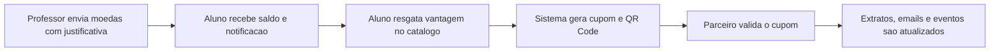

# Valoriza Aê

<p align="center">
  Plataforma SaaS de moeda estudantil para reconhecimento academico, resgate de beneficios e validacao de cupons por parceiros.
</p>

<p align="center">
  
  
  
  
  
  
</p>

---

## Visao Geral

O **Valoriza Aê** transforma participacao academica em beneficios reais. Professores enviam moedas para reconhecer boas entregas, alunos acompanham saldo e resgatam vantagens, e empresas parceiras validam cupons para confirmar que o beneficio foi usado corretamente.

O projeto foi evoluido para cobrir os requisitos das releases do sistema de moeda estudantil, incluindo cadastro completo de alunos, professores pre-cadastrados por instituicao, catalogo de vantagens, QR Code de cupom, ViaCEP, EmailJS, RabbitMQ, recuperacao de senha e uma interface React com organizacao por perfil.

---

## Fluxo Principal



---

## Perfis

### Aluno

O aluno usa o sistema para acompanhar reconhecimento academico e trocar moedas por beneficios.

- Cadastro com nome, email, senha, CPF, RG, endereco, instituicao e curso.
- Instituicoes e cursos ja ficam pre-cadastrados.
- O curso disponivel depende da instituicao escolhida.
- Painel com saldo, extrato, notificacoes e cupons.
- Catalogo com vantagens, imagens, custo em moedas e instrucoes de uso.
- Resgate de vantagem com cupom unico e QR Code.
- Bloqueio contra compra repetida da mesma vantagem.
- Recuperacao de senha por email.

### Professor

O professor ja vem pre-cadastrado pela instituicao participante.

- Perfil vinculado explicitamente a uma instituicao.
- Dados institucionais: nome, CPF, departamento e instituicao.
- Cota semestral de 1.000 moedas.
- Envio de moedas para alunos com justificativa obrigatoria.
- Historico de envios, notificacoes e extrato filtravel.
- Email de confirmacao quando um envio e realizado.

### Empresa Parceira

A empresa parceira cadastra beneficios e confirma o uso dos cupons.

- Cadastro de empresa parceira.
- Criacao, edicao, publicacao, pausa e exclusao de vantagens.
- Vantagens com titulo, descricao, imagem, custo em moedas e status.
- Validacao de cupom por codigo ou QR Code apresentado pelo aluno.
- Historico de resgates recebidos.
- Notificacao para cupons pendentes, validados, pausados ou reativados.

---

## Principais Funcionalidades

- Login por perfil com acesso restrito.
- Interface React em estilo SaaS.
- Dashboard separado para aluno, professor e empresa.
- Cadastro de aluno com instituicao e curso pre-cadastrados.
- Professores pre-cadastrados por instituicao.
- Envio de moedas com justificativa obrigatoria.
- Catalogo de vantagens com imagens e descricao pratica.
- Cupom unico para cada resgate.
- QR Code para apresentar o cupom ao parceiro.
- Validacao do cupom pela empresa.
- Bloqueio de cupom ja usado.
- Pausa de vantagem com notificacao para alunos que possuem cupom pendente.
- Extratos e notificacoes com filtro por periodo.
- EmailJS para notificacoes reais e recuperacao de senha.
- ViaCEP para preenchimento de endereco.
- RabbitMQ para eventos do sistema.
- Fallback local de fila no modo Quarkus sem Docker, mantendo rastreabilidade em desenvolvimento.

---

## Regras de Negocio

- Cada usuario acessa apenas o painel do seu perfil.
- Aluno precisa informar CPF, RG, endereco, instituicao e curso.
- O sistema valida se o curso pertence a instituicao selecionada.
- Professor precisa estar vinculado a uma instituicao.
- Professor recebe cota semestral de moedas.
- Envio de moedas exige valor positivo, saldo suficiente e justificativa.
- Resgate desconta moedas do aluno.
- Cada resgate gera um cupom unico.
- Aluno nao pode resgatar a mesma vantagem duas vezes.
- Empresa so valida cupom pertencente as suas vantagens.
- Cupom validado nao pode ser usado novamente.
- Vantagem pausada sai do catalogo e bloqueia validacao de cupons pendentes.
- Vantagem com historico de cupom nao e apagada do fluxo; deve ser pausada.
- Emails tambem ficam registrados como notificacoes internas.

---

## Integracoes

### RabbitMQ

O sistema publica eventos operacionais como:

- moedas enviadas;
- cupom gerado;
- cupom validado;
- cupom desativado;
- cupom reativado.

Em desenvolvimento local via `mvn quarkus:dev`, se o RabbitMQ nao estiver disponivel, o sistema usa uma fila local persistida no banco para nao travar a demonstracao. Em Docker/deploy, o RabbitMQ real pode ser exigido.

### QR Code

Ao resgatar uma vantagem, o aluno recebe um cupom e um QR Code. O parceiro pode consultar o codigo no painel de empresa e validar o atendimento.

### ViaCEP

Usado nos cadastros para preencher o endereco a partir do CEP.

### EmailJS

Usado para emails reais de notificacao e recuperacao de senha.

O template generico esta em:

```text
Código/docs/emailjs-template-aluno.html
```

No painel do EmailJS, o campo de destino deve usar:

```text
{{to_email}}
```

O botao principal do template usa:

```text
{{button_url}}
```

---

## Tecnologias

| Area | Tecnologia |
| --- | --- |
| Back-end | Java 17, Quarkus 3.15 |
| Front-end | React 18, Vite |
| UI | Lucide React, CSS modularizado por telas |
| Persistencia | JPA, Hibernate ORM, Panache |
| Banco local | H2 em memoria |
| Mensageria | RabbitMQ |
| QR Code | ZXing |
| Emails | EmailJS |
| CEP | ViaCEP |
| Testes | JUnit 5, Quarkus Test, Rest Assured |
| Build | Maven, npm |

---

## Estrutura

```text
Sistema-De-Moedas
|-- README.md
|-- Código
|   |-- frontend
|   |   |-- src
|   |   |   |-- components
|   |   |   |-- config
|   |   |   |-- hooks
|   |   |   |-- pages
|   |   |   |-- services
|   |   |   |-- styles
|   |   |   `-- utils
|   |-- src
|   |   |-- main
|   |   |   |-- java/br/com/sistemamoedas
|   |   |   |   |-- app
|   |   |   |   |-- controller
|   |   |   |   |-- domain
|   |   |   |   |-- repository
|   |   |   |   |-- security
|   |   |   |   `-- service
|   |   |   `-- resources
|   |   |       |-- META-INF/resources
|   |   |       |-- templates
|   |   |       `-- application.properties
|   |   `-- test
|   |-- docs
|   |-- docker-compose.yml
|   |-- Dockerfile
|   |-- start.ps1
|   `-- start-docker.ps1
`-- docs
```

---

## Como Rodar Pelo PowerShell

Abra o terminal na raiz do codigo:

```powershell
cd "C:\Users\Pichau\Desktop\Sistema-De-Moedas\Código"
```

Instale as dependencias do front-end:

```powershell
npm install
```

Compile o front-end React:

```powershell
npm run build:frontend
```

Inicie o Quarkus:

```powershell
mvn quarkus:dev
```

Acesse:

```text
http://localhost:8080
```

### Atalho

Tambem existe o script:

```powershell
.\start.ps1
```

Ele tenta subir o RabbitMQ por Docker Compose, compila o front-end e inicia o Quarkus.

---

## Rodando Com Docker

Na pasta `Código`:

```powershell
docker compose up --build
```

Servicos previstos:

- Aplicacao: `http://localhost:8080`
- RabbitMQ: `localhost:5672`
- RabbitMQ Management: `http://localhost:15672`

---

## Acessos Iniciais

| Perfil | Email | Senha |
| --- | --- | --- |
| Aluno | aluno@moedas.com | ValorizaAe#2026! |
| Professor | professor@moedas.com | ValorizaAe#2026! |
| Empresa | empresa@moedas.com | ValorizaAe#2026! |

Esses emails de exemplo sao usados para demonstracao local. Emails reais sao enviados pelo EmailJS quando o destinatario nao estiver em dominio interno bloqueado.

---

## Configuracoes Importantes

As principais variaveis podem ser sobrescritas por ambiente:

```properties
VALORIZA_APP_PUBLIC_URL=http://localhost:8080
VALORIZA_RABBITMQ_HOST=localhost
VALORIZA_RABBITMQ_PORT=5672
VALORIZA_RABBITMQ_USERNAME=guest
VALORIZA_RABBITMQ_PASSWORD=guest
VALORIZA_RABBITMQ_QUEUE=valoriza-ae.eventos
VALORIZA_RABBITMQ_LOCAL_FALLBACK=true
VALORIZA_EMAILJS_ENABLED=true
VALORIZA_EMAILJS_SERVICE_ID=service_hcguqt8
VALORIZA_EMAILJS_TEMPLATE_ID=template_l6qeu1d
VALORIZA_EMAILJS_PUBLIC_KEY=DNElHG9dfV97S6O_U
VALORIZA_EMAILJS_PRIVATE_KEY=gu3bxQw3GZzeFNmQWuutc
VALORIZA_EMAILJS_IGNORED_DOMAINS=moedas.com
```

---

## Comandos Uteis

```powershell
# Compilar front-end
npm run build:frontend

# Rodar testes
mvn test

# Compilar back-end sem testes
mvn -DskipTests compile

# Gerar pacote
mvn package
```

---

## Documentacao Complementar

```text
Código/docs/historias-usuario-expandidas.md
Código/docs/diagrama-er-acesso-dados.md
Código/docs/integracoes-rabbitmq-qrcode-viacep.md
Código/docs/release-2-3-diagramas.md
Código/docs/emailjs-template-aluno.html
```

Esses arquivos documentam historias de usuario, DER, estrategia ORM/DAO, integracoes e releases.

---

## Validacao

Ultima validacao usada no projeto:

```powershell
npm run build:frontend
mvn test
```

Resultado esperado:

```text
Tests run: 10, Failures: 0, Errors: 0, Skipped: 0
```

---

## Observacoes

- O banco H2 e em memoria; ao reiniciar, os dados iniciais sao recriados.
- Os dados iniciais ficam em `Código/src/main/java/br/com/sistemamoedas/app/DadosIniciais.java`.
- Para mudancas no React aparecerem no Quarkus, rode `npm run build:frontend`.
- Para o EmailJS funcionar em deploy, `VALORIZA_APP_PUBLIC_URL` precisa apontar para a URL publica do sistema.
- Em email real, imagens servidas por `localhost` nao carregam fora da maquina local; por isso o template de email usa uma marca visual em HTML.
